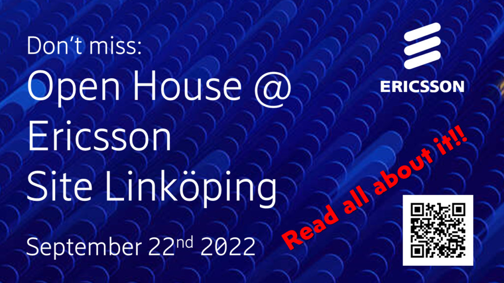

Welcome to OPEN HOUSE @ ERICSSON SITE LINKÖPING September 22nd!

Visit Ericsson Linköping for an inspiring evening!

Let us show you projects and demos ranging from HW development to Artificial Intelligence via large scale SW development techniques and Cloud based networks.

There will be seminars giving you a glimpse into the near future – topics like 6G, cloud techniques, ASIC, and connected agriculture are on the agenda!

We will also present a wide range of interesting master thesis project opportunities. Every year we host 20-30 thesis projects, and the Open House is where we start our search for the right students for them.

Food and drinks are highlights of every successful evening and will of course be served at the Open House!

Join us for a fun evening! Sign up today, or latest September 18th.

Details and sign up here: [https://forms.gle/ReC7PyZ6iJfd7tXXA](https://forms.gle/ReC7PyZ6iJfd7tXXA)

WELCOME!!!
