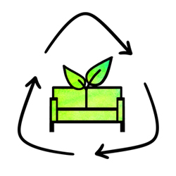

Just nu rekryterar LiU Student Secondhand (LSSh) nya medlemmar. LSSh är en secondhandbutik på LiU och är en del av hållbarhetsföreningen Navitas. Vi söker dig som tycker att hållbarhet är viktigt och har lite erfarenhet av webbutveckling.  
  
Bland öppna positioner finns bl.a. 2 st webbansvariga, där du får ansvar för att underhålla och utveckla vår skräddarsydda [hemsida](https://www.liustudentsecondhand.se/) som lanserades i december 2020. Hemsidan ger en perfekt chans att testa och förbättra dina färdigheter i webbprogrammering.  
  
Ansök [här](https://docs.google.com/forms/d/e/1FAIpQLScup_I32sKX2YC1Adnc0I83Mw81JcFmPEi2eeZ8_-S8t9NceQ/viewform) senast söndag den 18 september. Du kan hittar mer information kring postdetaljerna och rekryteringen på vår [Instagram](https://www.instagram.com/liustudentsecondhand/). 

