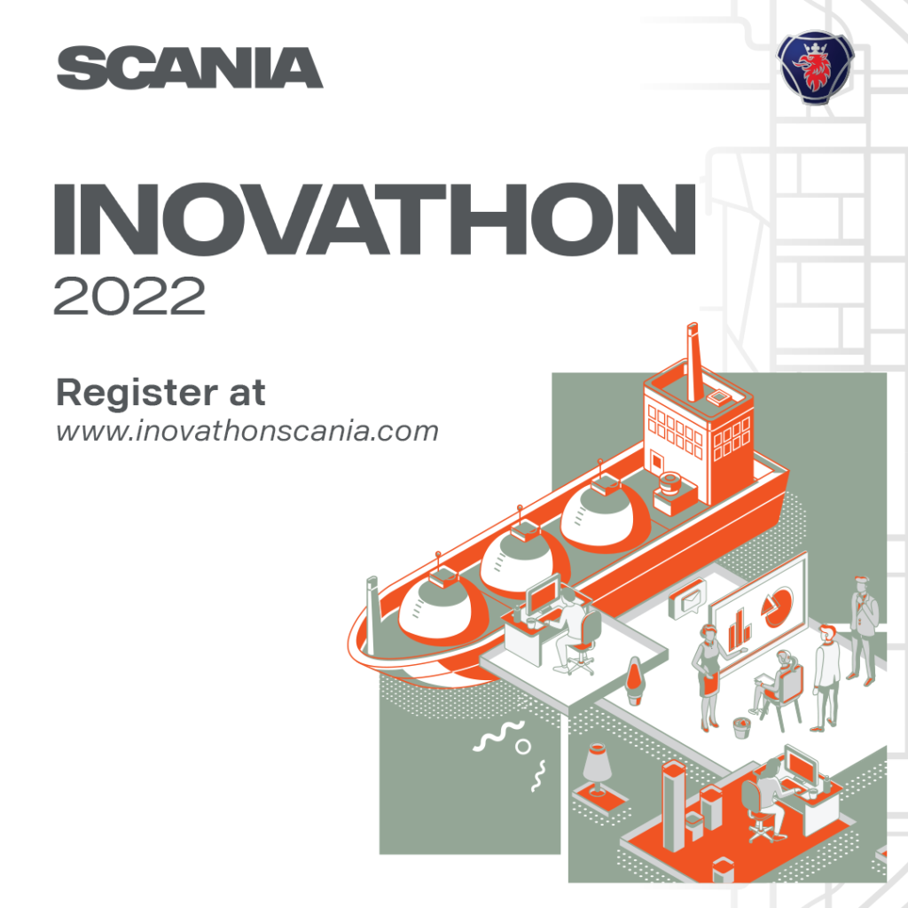

**How innovative are you?**   
We welcome you to join Scania’s innovation marathon – Inovathon!

  
It was started in Scania Latin America in Brazil in 2016 and now we expand it to welcome  
students from the Netherlands and Sweden as well. This time the focus will be on  
developing sustainable projects for logistics operations in land and sea transportation.

Inovathon is for university students from any area and semester, over the age of 18.   
We are fans of out-of-the-box ideas and so we have no course restrictions.

To join in this knowledge marathon, the essential requirement is to enjoy innovation and want to be part of sustainable change.   
It’s a once in a lifetime opportunity. So, you won’t miss it, will you? Go to [www.inovathonscania.com](https://eur01.safelinks.protection.outlook.com/?url=http%3A%2F%2Fwww.inovathonscania.com%2F&data=05%7C01%7Cemiha508%40student.liu.se%7Cbeacd020d02047eeca7408daa1fbd499%7C913f18ec7f264c5fa816784fe9a58edd%7C0%7C0%7C638000400234855554%7CUnknown%7CTWFpbGZsb3d8eyJWIjoiMC4wLjAwMDAiLCJQIjoiV2luMzIiLCJBTiI6Ik1haWwiLCJXVCI6Mn0%3D%7C3000%7C%7C%7C&sdata=BRnt8duxD0RLo4Ikpnv1aUaM5tDBZUGZ9LY85n7RafM%3D&reserved=0) be inspired, and register now!

