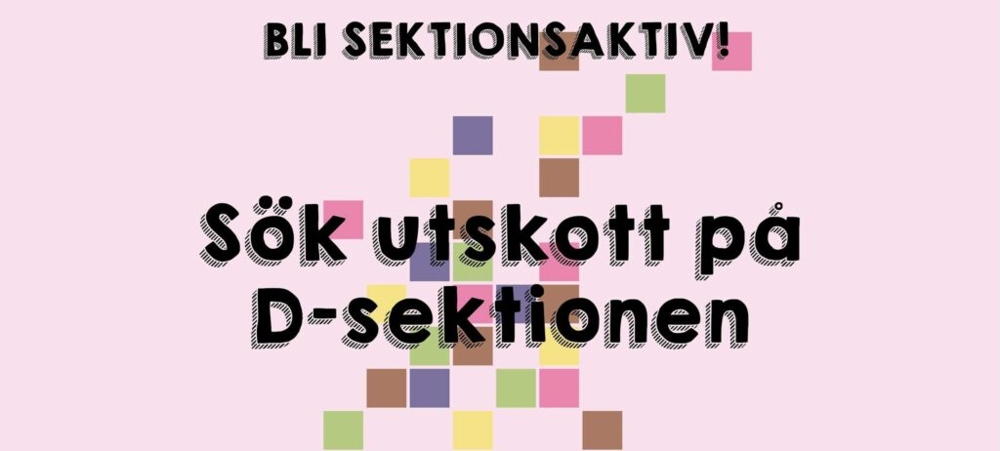

Vill du vara med och bidra till sektionen, träffa massor av nya människor och samtidigt ha väldigt kul? Då har du kommit helt rätt! På denna sida samlar vi information om alla rekryterande utskott samt länkar till ansökan.

Om du lyckas komma med i något av dessa utskott blir du sektionsaktiv. Detta innebär att du, förutom att bidra till vår verksamhet, får vara med på tre väldigt roliga evenemang under året som endast är för oss ca. 200 studenter som är sektionsaktiva.

Ansökningsperioden pågår den 11-25 september kl 23:59.

Vill du istället nominera någon till ett utskott får du gärna skicka iväg ett mail till utskottets ordförande med en motivering samt relevanta kontaktuppgifter till personen du nominerar.

**MafU**  
Ring-ding-ding ?! Marknadsföringsutskottet söker nu nya medlemmar ?! Vi söker dig som är villig att lära dig nya saker ?, träffa nya människor ?‍?‍?, och ha kul ?! Du behöver inte ha tidigare erfarenheter inom posterna ?️, det viktiga är att du är villig att lära dig ?!

MafUs uppgift ✅ är att rekrytera nya medlemmar ? till sektionen ? via bland annat mässor ? och hemmissioneringar ?, men även genom vårt älskade event D-Tour ♥️, där vi bjuder in gymnasieelever till Campus Valla ? för att få uppleva livet på D ?, samt studentlivet här på LiU ?!

Följande poster söks ?:

- Kassör ?
- D-Tour: Projektledare ?
- D-Tour: Boende- och logistikansvarig ?
- Hemmissioneringsansvarig ?
- PR / Info ?️
- Skolkontakt ?
- Aktivitetsansvarig(2 st) ?

MafU ger dig inte bara ett roligt läsår ⏳, utan det ger dig även erfarenheter ? som kommer att hjälpa dig i arbetslivet ?!

Vill du vara sektionens ansikte utåt ? och representera vår sektion ??

Ansök då ❗NU❗ via länken nedan:  
[https://forms.gle/dnLRnvaSqdhXLYLd6](https://forms.gle/dnLRnvaSqdhXLYLd6)

**Werkmästeriet**   

Werkmästeriet är de som tar hand om sektionens inventarier och lokaler. Det är vi som ser till att det finns kaffe att brygga i Netlight, att Configura inte fylls av pärmar och att Kianu Revs & Nikola FleXa rullar. Utöver det så ansvarar Werkmästeriet även för att märkesbacken blir målad och att ovvar säljs till nollan. Och skäller ut de som inte följer våra finfina regler kring uthyrning och logistik! 

Nu till hösten startas det stora projektet kring våra nya Sektionsrumm i HusETT! Werk kommer då ansvara för att flytta gamla möbler, fixa nya möbler och inreda våra två nya sektionsrum och göra de hemmastadd. 

Till hösten ska vi tillsätta tre poster; _TullWerk, ReningsWerk_ och _RenoveringsWerk_. Dessa poster kan ni läsa mer om och söka i ansökningsformuläret nedan: 

[https://forms.gle/2KAwGn6parycSETm6](https://forms.gle/2KAwGn6parycSETm6)

Sök D-sektionens enda Mästeri!

**D-LAN**

På vårterminen håller D-LAN i LiUs och Östergötlands största LAN, vilket alltid varit populärt på sektionen, särskilt nu när restriktionerna förhoppningsvis är borta för förutsebar framtid!

Just nu söker vi samtliga poster i gruppen. Dessa är:

- Projektledare
- PersonalWerk
- Elwerk
- Tryck & PR
- Nät
- Webb & Stream
- Turnering & Biljett
- Spons & Event

För frågor kan du kontakta Eventutskottets ordförande Erik Halvarsson på [aktivitetshanterare@d-sektionen.se](mailto:aktivitetshanterare@d-sektionen.se) eller förra årets projektledare Robin Boregrim på [projektledare@d-lan.se](mailto:projektledare@d-lan.se).

[https://forms.gle/zqEKE5DaUM2Bbkub8](https://forms.gle/zqEKE5DaUM2Bbkub8)

**D20**

D20 är Eventutskottets nyaste grupp, och är i praktiken väldigt lik AktU, förutom att de lägger allt fokus på allting rollspel. Eftersom gruppen är väldigt ung har de inte mycket historia eller förväntningar bakom sig, så det finns många möjligheter för att sätta sin egen prägel på gruppen ifall man har specifika ambitioner för en rollspelsförening. 

Rekryteringen kommer ske i två steg. Ordföranden kommer väljas in den 18:e, och därefter kommer ordföranden vara med för resterande rekrytering.

Just nu söker vi samtliga poster i gruppen. Dessa är:

- Ordförande
- 2x Tryck & PR
- 2x Eventansvariga
- GM-ansvarig

För frågor kan du kontakta förra årets D20-styrelse på deras [Discord-server](https://discord.gg/RqwywGy5cP), eller Erik Halvarsson på [aktivitetshanterare@d-sektionen.se](mailto:aktivitetshanterare@d-sektionen.se)

[https://forms.gle/2NscJiyjRSRq9x8E8](https://forms.gle/2NscJiyjRSRq9x8E8)

**InfU**

Infoutskottet ansvarar för att sektionens medlemmar får information om vad som händer på sektionen. Till detta använder vi så klart alla moderna verktyg som finns till vårt förfogande, inklusive lite äldre, men ack så användbara verktyg. Vi har även hand om att sektionens hemsida hålls uppdaterad och relevant, samt skriver daxRedaxsidorna i LiTHanian.

[https://forms.gle/XFwhkaYrNiYqnm48A](https://forms.gle/XFwhkaYrNiYqnm48A)

**AktU**

Aktivitetsutskottet ansvarar för att fylla studentlivet med roliga aktiviteter för att stärka gemenskapen mellan oss på sektionen men även bara ha superskojsiga häng med AktU och andra aktivitetsintresserade. AktU är bland de utskott som håller i flest event vilket är varför vi söker folk som har ett starkt intresse av att planera små som stora event och är redo att få oförglömliga minnen från studietiden. Några event som vi har bedrivit tidigare är allt från veckoenlig fotboll och innebandy till att hålla i fulsittningar och hjälpa andra utskott med att bedriva aktiviteter. Just nu söker vi 5 taggade människor som vill dela glädjen av ett lyckat event.

De poster vi söker nu är Tryck och PR, Brädspelsansvarig, Onlineevents-ansvarig, och två stycken Allt-i-Allo. Om du är nyfiken på vad posterna innebär så finns det mer info i formuläret nedan. 

[https://forms.gle/67TYtsnRQohve8ZC6](https://forms.gle/67TYtsnRQohve8ZC6)

**NärU**

Näringslivsutskottets främsta uppgift är att sköta kontakten och samarbetet mellan sektionen och näringslivet. Det är vi som ansvarar för att vårda och utveckla kontakten mellan studenterna på sektionen mot vår huvudsponsor och samarbetspartners. En stor del av det arbete som vi gör är att planera roliga företagsevent samt att lägga upp diverse annonser!

Vi söker nu en sektionsansvarig och en marknadsföringsansvarig, samt några trevliga företagsansvariga. Mer information om de olika posterna finns i formuläret!

[https://forms.gle/5zXf3gkdog4keJH28](https://forms.gle/5zXf3gkdog4keJH28)

**PubU**

PubU, Pub-utskottet eller Pubben är utskottet för den som älskar mat. Vi anordnar ungefär en gång per månad en pub tillsammans med ett företag som i sin tur då bjuder på maten. 

Vi söker nu några ytterligare medlemmar till att fortsatt hjälpa oss mata sektionen, SÖK NUUU!

[https://forms.gle/Lb4UYqJLEzM3vzqEA](https://forms.gle/Lb4UYqJLEzM3vzqEA)
