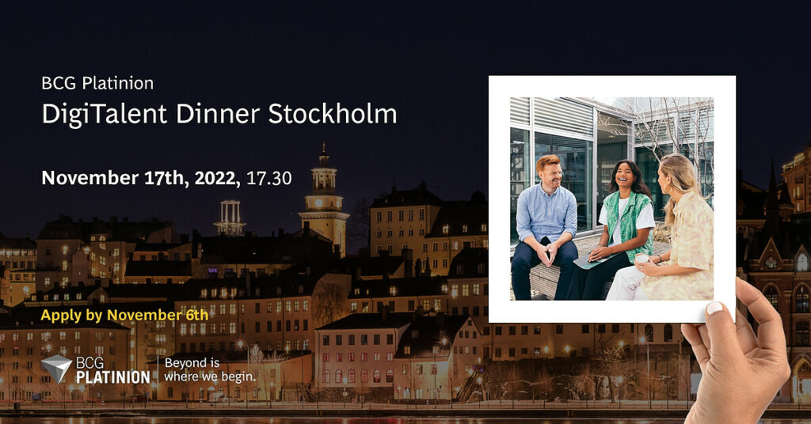

Curious to know what a career in management consulting with a digital and tech twist looks like? Join us for an event with BCG Platinion in Stockholm to find that out! 

BCG Platinion is the tech strategy-focused part of Boston Consulting Group (BCG) and works on various business-critical digital and IT cases with many of the largest companies in any industry. 

The evening consists of an introduction to BCG Platinion at our office in Stockholm and a relaxed dinner at a restaurant nearby. You will meet consultants with a similar background to yours and hear how you can follow their path and join our team!  

**Date**: Thursday, November 17th, 2022 

**Time**: 17.30 

**Location**: BCG Stockholm office, Kungsgatan 57, 111 22 Stockholm 

Read more and apply to the DigiTalent Dinner Stockholm via this link by November 6th: [https://careers.bcg.com/event/633d0b546cd1fd6ceef00cf4/DigiTalent-Dinner-Stockholm-2022](https://eur01.safelinks.protection.outlook.com/?url=https%3A%2F%2Fcareers.bcg.com%2Fevent%2F633d0b546cd1fd6ceef00cf4%2FDigiTalent-Dinner-Stockholm-2022&data=05%7C01%7Cemiha508%40student.liu.se%7C0f3719b8b2234519f75808daad15b823%7C913f18ec7f264c5fa816784fe9a58edd%7C0%7C0%7C638012606052011291%7CUnknown%7CTWFpbGZsb3d8eyJWIjoiMC4wLjAwMDAiLCJQIjoiV2luMzIiLCJBTiI6Ik1haWwiLCJXVCI6Mn0%3D%7C3000%7C%7C%7C&sdata=SOv3elSeExzFbIzsXPjnfuN5N1xPQkZPFhqPB6t6HVo%3D&reserved=0)  

Looking forward to meeting you!

Travel expenses between Linköping and Stockholm will be reimbursed.

