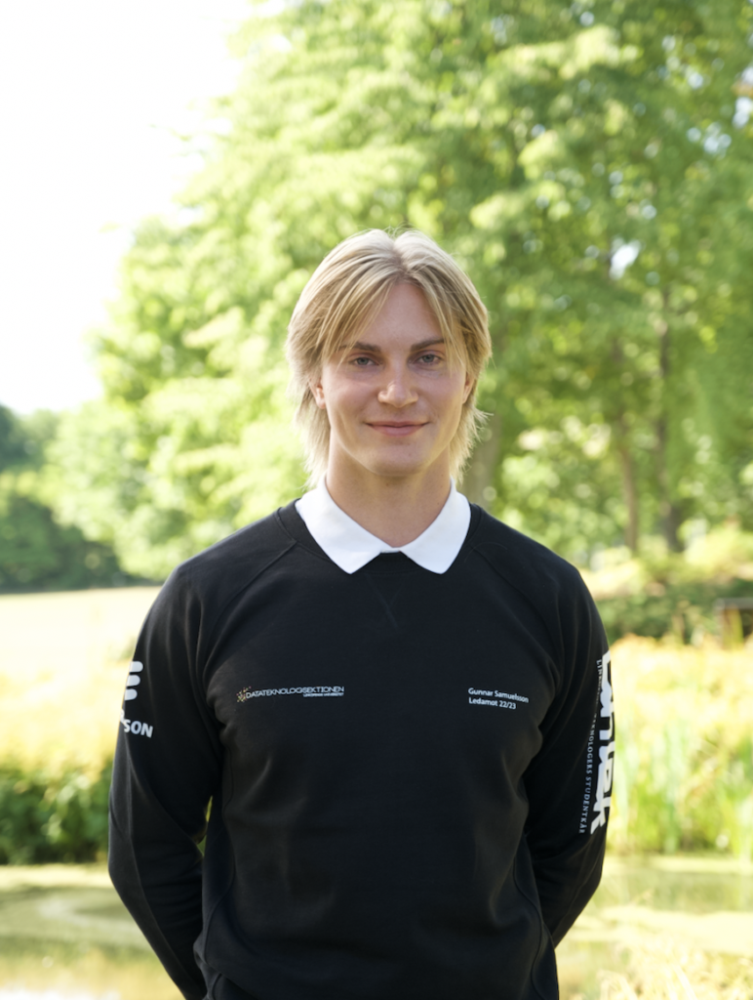
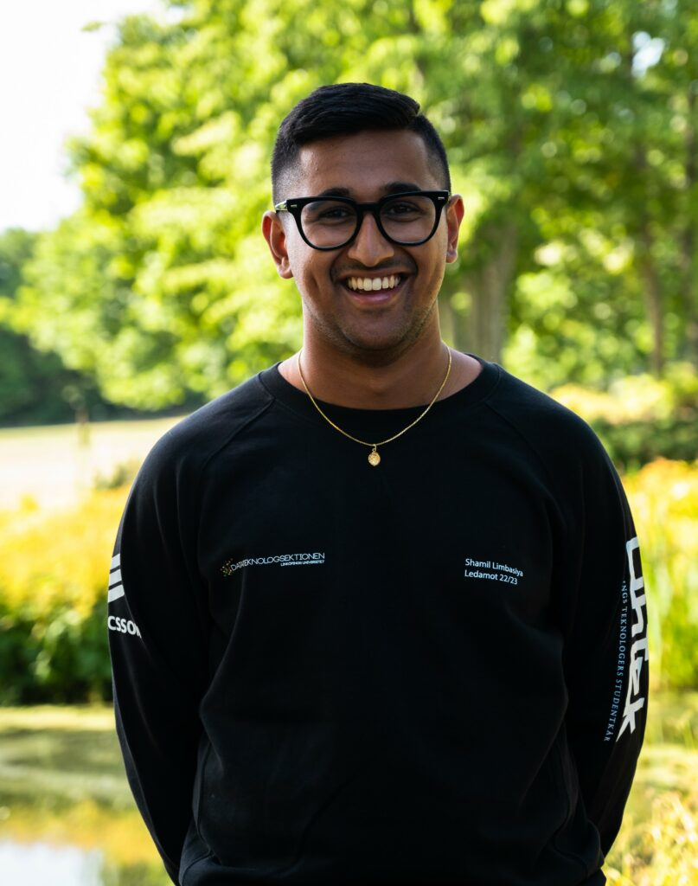
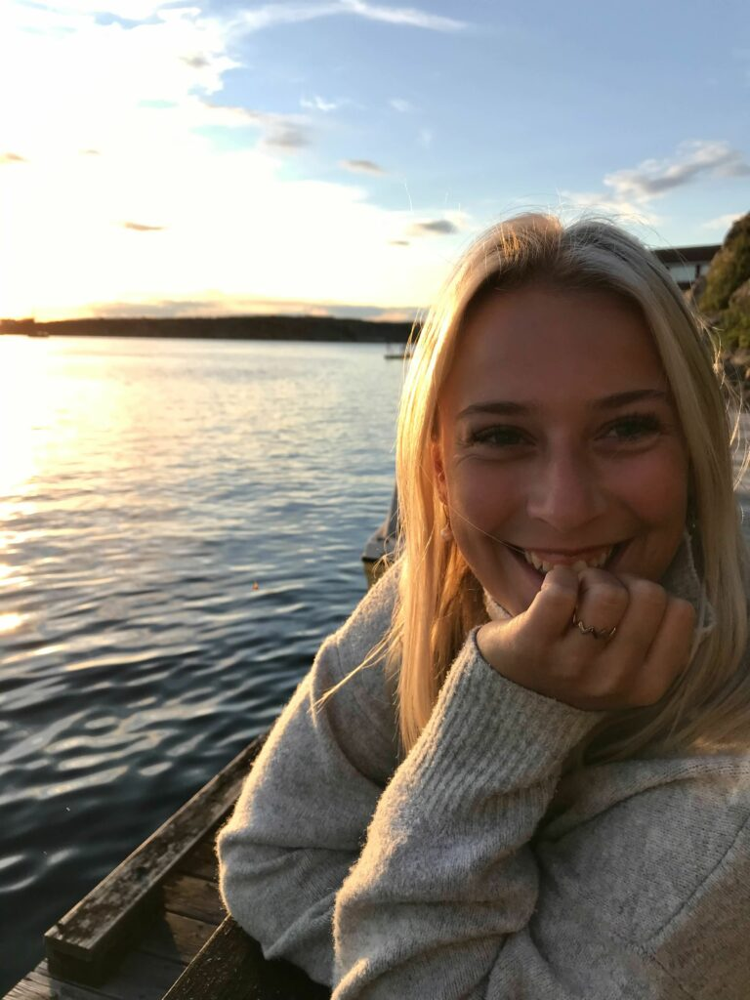

**Ledamot - Gunnar**

Beskriv dig själv samt dina uppgifter som ledamot

Mitt namn är Gunnar Samuelsson och jag är 22 år gammal och läser IT3. Jag kommer ursprungligen från den mytomspunna järnvägsknuten Nässjö och är för närvarande en av två ledamöter i styret! Till följd av mitt stora intresse för idrott och hälsa spenderas en stor del av min fritid i gymmet, löparspåret eller på golfbanan. Det kan även hände att en och annan utgång slinker bland dessa aktiviteter.

Som ledamot är man först och främst en resurs i styrelsen. Då ledamöter inte har något på förhand specificerat ansvarsområde har man möjlighet att ta hand om och lösa saker som annars kanske kan falla mellan stolarna i styrelsearbetet. Man medverkar i det allmänna styrelsearbetet, hjälper till att planera, förbereda och genomföra både sektionsmöten och sektionsaktivas. Just sektionsaktivas förväntas man som ledamot spendera mer tid på än övriga styrelsemedlemmar och det är mycket viktigt och mycket kul! Uppgifterna som dyker upp kan vara allt från att delta i diskussioner om det strategiska arbetet på sektionen eller köpa pizza och koka kaffe till ett sektionsmöte. Under lugnare perioder har man även möjlighet att driva egna tankar och ideér för sektionen till följd av den mer flytande rollen.

Vad fick dig att söka ledamot?

Jag sökte posten som ledamot då jag ville få en bättre insyn i hur datasektionen fungerar som organisation. Jag hade inte tidigare varit aktiv i sektionen och ville som sagt veta mer om hur det ser ut "bakom kulisserna" i sektionen. Jag upplever även att sektionen anordnar mycket kul saker och bidrar till en känsla av gemenskap på utbildningen. Att söka till ledamot såg jag då som en möjlighet till att personligen bidraga och ge tillbaka till medlemmarna!

Vad har varit det roligaste med att vara ledamot?

Enligt mig har det roligaste varit att rollen är just flytande. Man får göra många olika saker och man vet aldrig vad som dyker upp. Här om veckan fick exempelvis jag och min ledamotskollega Shamil representera vår sektion i Lund då deras datasektion firade 40-års jubileum. Till följd av sjukdomsfall hos ordförande Wahlund fick vi åka med kort varsel och det var mycket roligt och lärorikt! Även om detta inte är specifikt för posten som ledamot tycker jag att det visar på att det bär med sig mycket kul saker att vara sektionsaktiv i största allmänhet!

Behöver man någon tidigare erfarenhet för att vara ledamot?

Som tidigare nämnt hade jag inte tidigare varit sektionsaktiv innan jag sökte rollen som ledamot. Inte heller hade jag tidigare erfarenhet av styrelsearbete eller dylikt! Det viktigaste är att man tycker det är kul att bidra till sektionen och vill driva verksamheten framåt!

Har du något mer du vill tillägga?

Sök ledamot! Har du några frågor eller funderingar kan du kontakta mig på gunnar.samuelsson@d-sektionen.se! Väl mött!

**Ledamot - Shamil**

Beskriv dig själv samt dina uppgifter som ledamot

Holla! Jag heter Shamil och pluggar mitt tredje år på D. Är född och uppvuxen i samma lilla håla som Björn Ulvaeus, även känt i folkmun som Västervik. Som ledamot hjälper man till där det behövs och är tillgänglig för att kunna driva projekt inom sektionen. Man är även mer ansvarig för sektionsaktivas planering. Utöver detta är man även med och delar med sig av sina åsikter i de beslut som styret fattar.

Vad fick dig att söka ledamot?

Det som jag tyckte var intressant med posten var främst att vi fick vara involverad i styret. Sedan verkade det även kul att få vara ledamot då det är en mer varierande post och det blir vad man gör den till.

Vad har varit det roligaste med att vara ledamot?

Det roligaste med posten är att få vara med i styret och arbeta tillsammans med de andra. Vi får vara de som hoppar in där det behövs och får anordna det som är allra roligast nämligen sektionsaktivas. Dessutom får man också en bra överblick över hur hela sektionen arbetar vilket är väldigt intressant.

Behöver man någon tidigare erfarenhet för att vara ledamot?

Det som är bra med ledamot är man inte behöver några tidigare erfarenheter utan det handlar främst om ens egna driv och engagemang.

**Utbildningsutskottets ordförande - Emma**

Beskriv dig själv samt Utbildningsutskottets ordförandens uppgifter

Hej hej allihopa! Emma heter jag och sitter som Utbildningsutskottets Ordförande i Styret 22/23.

Jag är en glad tjej som drivs av att få träffa och lära känna nya personer. Just nu pluggar jag U3 och har länge tänkt och velat engagera mig mer mot universitetet vilket jag nu fått göra i min post. Postens uppgifter inkluderar möten med ett dö gött gäng SnOrdfar och med LinTek/universitet. Sedan sitter man även med i styret och får vara med i styrelsearbetet. Mitt primära uppdrag är att se till att vi som sektion följer våra uppdrag kring kursutvärderingar och utbildning gentemot LinTek. I praktiken innebär det att se till att allting som ska göras görs och att stötta SnOrdfarna i deras uppgifter. Det vill säga ha den övergripande kollen! Sedan har man några andra uppdrag som att arrangera interna event för hela utskottet UtbU (kickoff, midoff och fuckoff), se till att gemenskapen och kommunikationen med hela utskottet rullar på, se till att vi har pluggstugor, planera och genomföra pedagogpriset samt (den uppdaterade!!) utvärderingstävlingen.

Vad fick dig att söka Utbildningsutskottets ordförande?

Det som fick mig att söka var som ovannämnt, jag var fett taggad på att engagera mig mer mot universitetet och har länge varit sugen på att få sitta med i styret och lära mig om hur styrelsearbetet fungerar.

Vad har varit det roligaste med att vara Utbildningsutskottets ordförande?

Roligaste med posten är att få arbeta med och träffa så många människor. Det är garanterat en stor fördel är att vi är ett så stort utskott med härliga studenter på olika poster i sektionen samt att man får det sektionsöverskridande kontakterna via utbildningsråd med exempelvis LinTek. Sedan känns de också väldigt bra att få se och vara delaktig i positiva förändringar!

Behöver man någon tidigare erfarenhet för att vara Utbildningsutskottets ordförande?

Lite översikt över hur sektionen fungerar kan vara fördelaktigt, men de viktigaste är att man har lite driv, lite vilja och är taggad på att försöka göra positiva förändringar på sektionen. Har du ett intresse för att göra skillnad som påverkar oss studenter nu, studenter efter oss och oss själva i framtiden bör du söka denna härliga post!!
