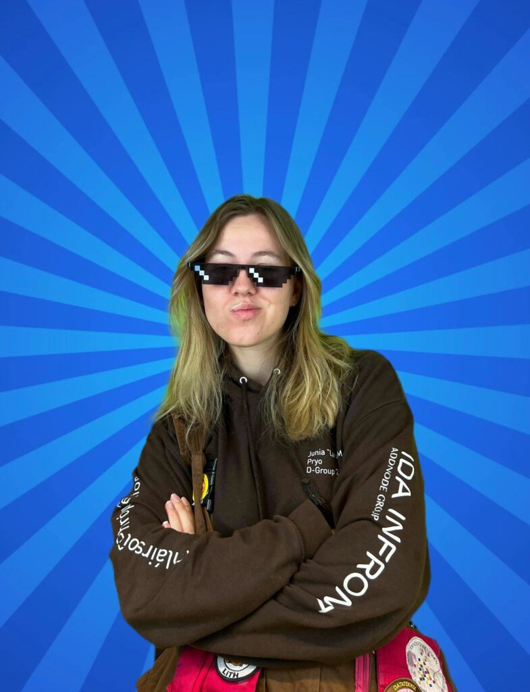
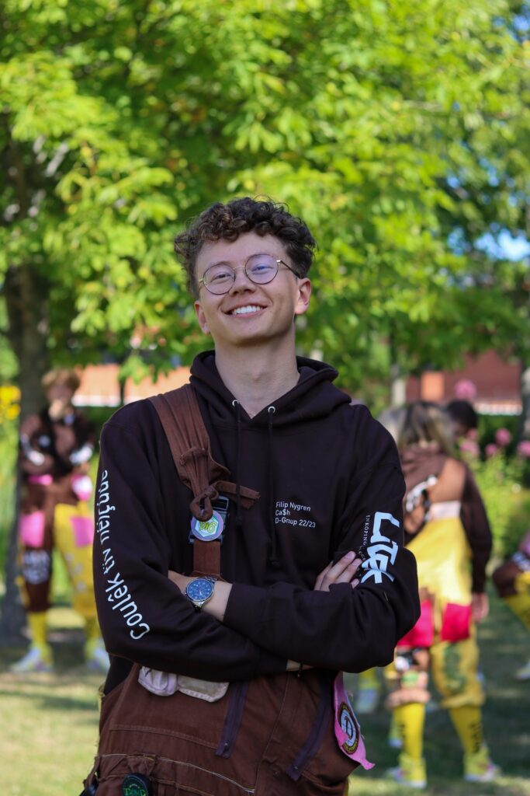

**D-Group Chief**

Beskriv dig själv samt dina uppgifter som festeriets ordförande

Jag heter Junia och är Chief för D-Group 22/23! Jag skulle beskriva mig själv som en ganska social och ambitiös person som tycker om att testa på nya saker och lära känna nya människor. Som Chief i D-Group har jag huvudsakligen ansvar för att gruppen har en bra sammanhållning samt att se till att arbetet som vi ska göra görs. Jag går på mycket möten och pratar med personer från olika organisationer och festerier. 

Vad fick dig att söka festeriets ordförande?

Jag valde att söka D-Group då jag ville engagera mig mer i studentlivet. Sen såg jag även hur D-Group 21/22 arbetade och vad de höll i för event och jag tyckte det såg otroligt roligt ut! Sen varför jag valde att söka just Chief är för att jag ville testa att ta på mig en roll med mycket ansvar. Innan hade jag lite erfarenhet av ledarskap och anordna större event så jag visste redan att jag trivdes i en ledarskapsroll vilket gjorde att jag valde att söka rollen som Chief. 

Vad har varit det roligaste med att vara festeriets ordförande?

Att få va med och lära känna och arbeta ett gäng otroliga människor som man själv har intervjuat och valt in för att vara D-Group 22/23 med. Det är en otrolig sammanhållning man får och man blir ett väldigt tight gäng, och att vara en drivande kraft bakom arbetet vi gör och se till att alla har kul har varit en fröjd. 

Behöver man någon tidigare erfarenhet för att vara festeriets ordförande?

Jag skulle inte säga att man måste ha tidigare erfarenhet för att bli Chief, det mesta kan man lära sig. Det jag tror är viktigt är att man tycker det är kul och man är motiverad att lära sig det man inte kan! Sen hjälper det nog om man är en ganska social person då majoriteten av ens arbete är att prata med människor :)

Har du något mer du vill tillägga?

Jag kan inte trycka nog på hur roligt jag haft under den tiden jag har varit invald. Om man tycker att det låter intressant att vara Chief så kan jag inte göra mer än uppmana er att söka!

**D-Group Kassör**

Beskriv dig själv samt dina uppgifter som festeriets kassör

Filip heter jag, jag är 22 år gammal från Stockholm. Jag är kassör i D-Group 22/23, en post jag trivs i eftersom jag är en noggrann person som gillar att ha en överblick av vad som händer. Som kassör är min postspecifika huvuduppgift att se till så D-Groups ekonomi under året går ihop. Jag samarbetar med nästan alla andra groupies under planeringsfasen av ett evenemang och får vara med och bestämma mycket, därför hjälper det att jag är social och tycker om att jobba med andra människor.

Vad fick dig att söka festeriets kassör?

Jag sökte kassör eftersom jag tyckte att D-Group såg ut som ett sjukt roligt utskott att vara en del av. Just kassörsposten var en utav posterna som jag tyckte passade mig, så jag chansade och sökte!

Vad har varit det roligaste med att vara festeriets kassör?

Det absolut roligaste med att vara kassör är att vara en central del av D-Group och få hänga och jobba tillsammans med alla andra groupies och medlemmar i andra festerier och utskott!

Behöver man någon tidigare erfarenhet för att vara festeriets kassör?

Det behövs egentligen ingen tidigare erfarenhet för att vara kassör!

Har du något mer du vill tillägga?

Sök!
