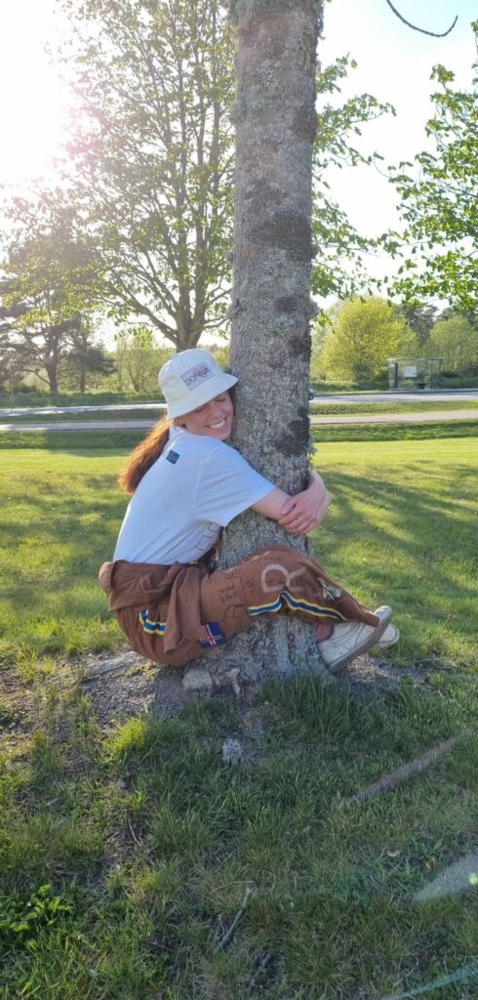
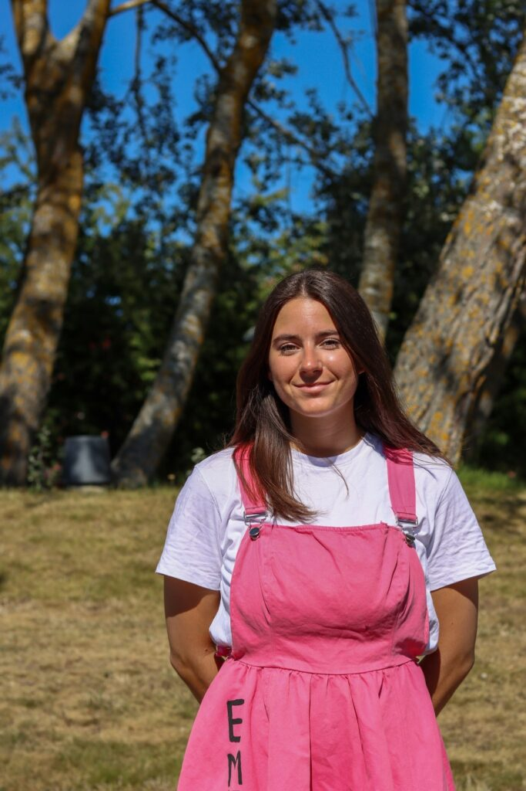

**PrimaDonna - Jorunn**

Beskriv dig själv samt PrimaDonnans  uppgifter

Tjo! Jag heter Jorunn Jóhannesdóttir, är 23 år och kommer ifrån Uppsala. Jag går just nu U2, men innan jag började plugga här på LiU så pluggade jag japanska (och lite annat smått och gott), så just nu går jag faktiskt mitt 5e år på universitet. När jag inte pluggar eller Donna:r så gillar jag spela spel (tft platinum coming soon), rita och dansa på kravaller.

Som PrimaDonna är min största uppgift att leda gruppen och sköta kommunikation utåt. Jag kallar till möten, gör dagordningar, ser till att vi har en övergripande planering, går på kanslimöten och möten med ordförande i de andra damföreningarna - det är alltså mycket möten, kommunikation och planering som ingår i posten.

Vad fick dig att söka PrimaDonna?

Jag sökte posten som PrimaDonna därför att jag tyckte att det var väldigt roligt att vara sektionsaktiv, där man får både ett kul umgänge och samtidigt kan bidra med något till sektionen. Sen så är Donna (enligt mig) ett av sektionens viktigaste utskott, så jag tyckte att det kändes både betydelsefullt och spännande att få vara ordförande och leda utskottet under ett verksamhetsår.

Vad har varit det roligaste med att vara PrimaDonna?

Det är mycket som har varit väldigt roligt med att få vara PrimaDonna! Jag har fått lära mig mer om sektionen och hur det går till att arrangera event, lära känna de andra damföreningarna, och har fått lära mig hur det är att leda ett utskott. Men det bästa har ju så klart varit att få lära känna, jobba och (framför allt!) ha jättekul med resten av mitt kära Donna! <3

Behöver man någon tidigare erfarenhet för att vara PrimaDonna?

Jag tycker inte att det finns någon tidigare erfarenhet som är ett krav för att vara PrimaDonna! Det hjälper så klart om du har varit engagerad i sektionen innan och vet lite mer om hur allting funkar, och om du har erfarenhet av att leda en grupp. Men det är inget krav!

Har du något mer du vill tillägga?

Sök!!! Det är lätt att tänka det alltid finns någon annan som är mer lämpad än en själv på en viss post eller ett visst uppdrag, men ibland så är faktiskt den mest lämpade personen just DU. Så, om du tror att Donna är något för dig, sök!

**Donnakassör - Emelie** 

Beskriv dig själv samt dina uppgifter som Donnakassör

Halloj! Emelie heter jag och är kassör i Donna 22/23. Jag är 24 år, kommer från Stockholm (139!!) och pluggar U2. Några intressen jag har är att lösa korsord, virka, gå promenader och skidåkning. Under mina sabbatsår hann jag bland annat med att göra 1,5 säsong i alperna (tack covid<33). Som kassör i Donna ser jag till att Donna inte spenderar för mycket pengar, håller koll på vår budget inför och efter event samt att alla våra kvitton hamnar på rätt ställe.

Vad fick dig att söka Donnakassör?

Varför jag sökte kassör var dels för att jag ville vara med och engagera mig i sektionen och då kände jag att det var Donna som lockade mest. Jag ville även vara med och utveckla Donnas arbete för att upprätthålla och förbättra gemenskapen bland tjejer och icke-binära på sektionen och då är kassör en bra post för att vara involverad i det arbetet. 

Vad har varit det roligaste med att vara Donnakassör?

Det roligaste har nog varit att få agera vice-ordförande och försöka få ihop Donna-styret så att alla i gruppen känner sig trygga och bekväma. Som kassör får man även en övergripande koll på vad alla i andra gruppen håller på med, vilket både är kul och lärorikt. Jag är även väldigt tacksam över hur många fina personer man har fått möjligheten att träffa både i och utanför utskottet. 

Behöver man någon tidigare erfarenhet för att vara Donnakassör?

Det behövs inte några specifika erfarenheter sen tidigare men för din egen skull är det en stor bonus om du är snabblärd, strukturerad samt inte är alltför obekant med excel!

Har du något mer du vill tillägga?

SÖÖÖK!!! Du kommer inte ångra dig. Tveka inte att höra av dig till mig om du har några frågor kring posten eller Donna generellt, vi finns här för att hjälpa dig!!
