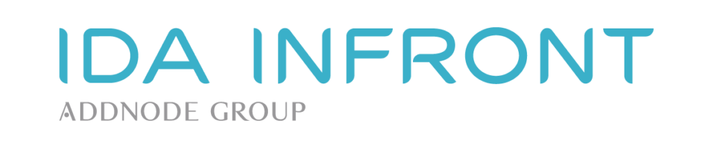

Vi söker två personer som tycker programmering är bland det roligaste man kan göra och som vill göra oss sällskap under åtta veckor i sommar. Årets projekt handlar om att implementera en integration som gör Outlook-kontakter tillgängliga i användargränssnittet i vår produkt iipax case.

Låter det spännande? ?

Då ser vi fram emot din ansökan via [https://idainfront.se/karriar/for-dig-som-studerar/](https://idainfront.se/karriar/for-dig-som-studerar/)
