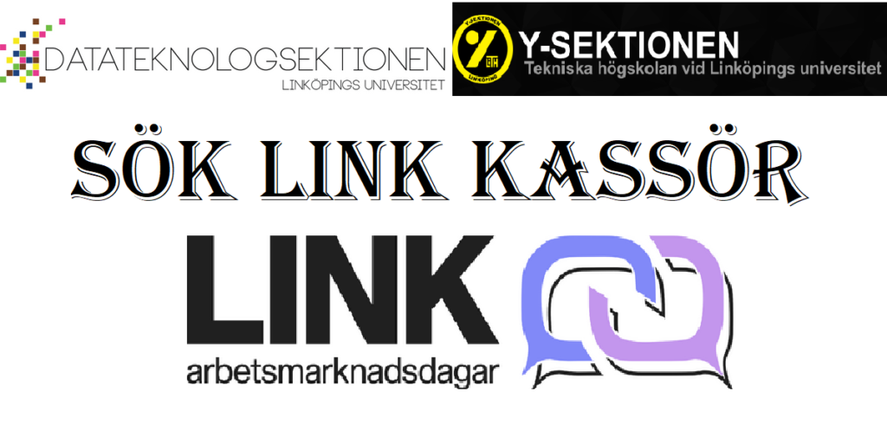

Nu kan du ansöka eller nominera till LINK kassör/Vice projektledare 2023!

Vill du planera nästa års LINK och leda en stor grupp? Ha koll på alla företag som kommer på LINK och se till att ekonomin går ihop? - Då ska du ta chansen att söka LINK kassör.

Som vice projektledare/kassör för LINK-dagarna ansvarar du tillsammans med projektledaren för genomförandet av LINK-dagarna. Du är också ytterst ekonomiskt ansvarig, vilket innebär ansvar över bland annat budgetering och bokföring. 

LINK-dagarna anordnas med studenter från D och Y med hjälp av studenter från I, LING och Saks och är ett bra tillfälle att knyta kontakt med studenter från andra sektioner. Posten innebär också mycket kontakt med näringslivet, och goda möjligheter till att knyta kontakter för framtiden. Man får också erfarenhet av att leda ett stort projekt, där det finns mycket utrymme för egna tankar och förbättringar. 

Posten innebär mycket eget ansvar för de ekonomiska delarna, samt också mycket utrymme för egna idéer om hur man bäst bistår projektledaren i rollen som vice projektledare.Ansökan är öppen till 22 januari och både ansökningar och nomineringar görs via följande formulär: [https://forms.gle/4LJ9vrpVWe9yi2cCA](https://forms.gle/4LJ9vrpVWe9yi2cCA)
