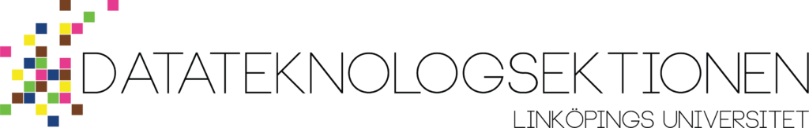

Hej kära D-student! Här kommer information om sektionens vintermöte att samlas. Ett sektionsmöte är sektionens högst beslutande organ, och det är sektionsmöten som beslutar om till exempel sektionens budgetering, framtida arbetssätt, stadgar, reglemente, med mera. För mer information om hur ett sektionsmöte fungerar finns en beskrivning av relevanta termer och processer på [d-sektionen.se/sektionsmote](https://d-sektionen.se/sektionsmote/).

Observera att mycket information kommer läggas till under de kommande veckorna, så denna sida kommer att uppdateras kontinuerligt.

På mötet kommer det bjudas på kvällsmat i form av pizza från mona-lisa! [Anmäl dig innan 25/1 för att få gratis pizza.](https://docs.google.com/forms/d/e/1FAIpQLSc_cgrom34EOY9IA1WaqkqYaIf5d2pD-h0cpoJD9L2ER8MdlA/viewform)

## Föredragningslista

[Föredragningslista](https://d-sektionen.se/wp-content/uploads/2023/01/f_redragslista_vinterm_te.pdf)

[Slutgiltig föredragningslista](https://d-sektionen.se/wp-content/uploads/2023/01/f_redragslista_vinterm_te-1.pdf)

## Nomineringar

### Valberedningen har nominerat

- Sektionsordförande: Silva Havluciyan
- Sektionskassör: Henrik Thorén
- Vice ordförande: Filip Nygren
- Sekreterare: Felix Ramnelöv
- Utbildningsutskottets ordförande: Vakant
- Arbetsmiljöombud: Vakant
- Styrelseledamöter: Gustav Bornander, Hannes Lindström
- Damföreningens ordförande: Vakant
- Damföreningens kassör: Felicia Fredriksson
- Festeriets ordförande: Disa Kärnbring
- Festeriets kassör: Sara Egeld
- Eventutskottets ordförande: Bacilika Glansholm

## Motkandideringar

- Damföreningens ordförande: Alma Mateo Johansson
- Utbildningsutskottets ordförande: Darja Saed
- Festeriets kassör: Dan Suleiman

## Att motkandidera

Glöm inte att du är mer än välkommen till att _motkandidera_ till någon av de poster som ska väljas in på mötet. Att motkandidera innebär att man, på mötet, kan nominera sig själv eller en annan till någon av posterna, utan att tidigare ha blivit nominerad av t.ex. valberedningen. Du kan även motkandidera genom att skicka ett mail till [sekreterare@d-sektionen.se](mailto:sektreterare@d-sektionen.se) där du skriver lite kort om dig själv samt vilken post du vill motkandidera till.

### Presentation vid personval

Då du kandiderar till en post ska du under mötet presentera dig för mötet genom att berätta lite om dig själv och svara på eventuella frågor. För att ge en bild av vad presentationen innebär har styrelsen tagit fram några punkter över vad du skulle kunna berätta om:

- Vem du är
- Eventuella tidigare erfarenheter/engagemang utanför LiU
- Eventuella tidigare erfarenheter/engagemang på LiU
- Varför du söker en post
- Vad du skulle vilja göra med utskottet/posten

Dessa är endast förslag, och du är självklart fri att välja helt egna punkter att ta upp. De listade punkterna kommer finnas synliga på en duk under tiden du är uppe och presenterar.

## Dokument

- [Kallelse](https://d-sektionen.se/wp-content/uploads/2023/01/Kallelse_vinterm_te.pdf)
- [Stadgar](http://styrdokument.d-sektionen.se/stadgar.pdf)
- [Reglemente](http://styrdokument.d-sektionen.se/reglemente.pdf)
- Motionsmall [pdf](https://d-sektionen.se/wp-content/uploads/2019/12/Motionsmall-D-sektionen-2020.pdf), [odt](https://d-sektionen.se/wp-content/uploads/2019/12/Motionsmall-D-sektionen-2020.odt), [docx](https://d-sektionen.se/wp-content/uploads/2019/12/Motionsmall-D-sektionen-2020.docx)
- [Policy för elektroniskt röstningssystem i samband med sektionsmöten](https://d-sektionen.se/wp-content/uploads/2019/10/elektroniskrostningpolicy.pdf)

## Inkomna dokument

- [Budgetrevidering](https://d-sektionen.se/wp-content/uploads/2023/01/Budgetrevidering-vintermotet-2023-combined.pdf)

## Motioner och propositioner

- [Motion angående uppdatering av reglemente kring ekonomisk verksamhet](https://d-sektionen.se/wp-content/uploads/2023/01/Motion-om-uppdatering-av-reglemete-kring-ekonomisk-verksamhet.pdf)
    - [Motionssvar](https://d-sektionen.se/wp-content/uploads/2023/01/Motionssvar_-Motion-angaende-uppdatering-av-reglemente-kring-ekonomisk-verksamhet.pdf)
