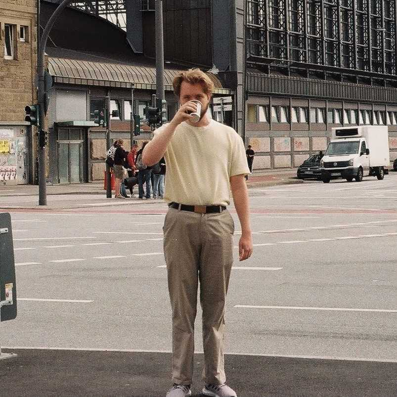

_Beskriv dig själv samt Marknadsföringsansvarigs uppgifter_

Hej! Jag heter August Vesterbacka och är ordförande för Marknadsföringsutskottet på D-sektionen. Jag tycker om att gå i naturen och hasardspel. Posten handlar om att hantera/delegera arbete kring hemmissionering och D-tour (Ett besök av gymnasieelever på Campus) med ett görgött gäng.

_Vad fick dig att söka Marknadsföringsansvarig?_

Jag hade inte innan varit ordförande och var intresserad av att testa på att strukturera upp ett projekt och leda ett utskott.

_Vad har varit det roligaste med att vara Marknadsföringsansvarig\]?_

Det roligaste med Mafu är att samarbeta och umgås med resten av utskottet samtidigt som man genomdriver ett betydande arbete att få mer gymnasieelever att börja på D-sektionen. Det roligaste med att vara ordförande inom Mafu har varit att skapa gemenskapen och en bra gruppdynamik mellan medlemmarna.

_Behöver man någon tidigare erfarenhet för att vara Marknadsföringsansvarig?_

Tidigare erfarenhet inom ledarskap är bidragande, men inte ett krav. Jag själv hade inte varit ordförande förut men det gick kämpe toppe g ändå.

_Har du något mer du vill tillägga?_

Letsgo
