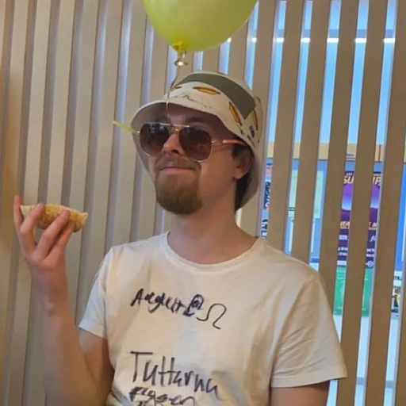
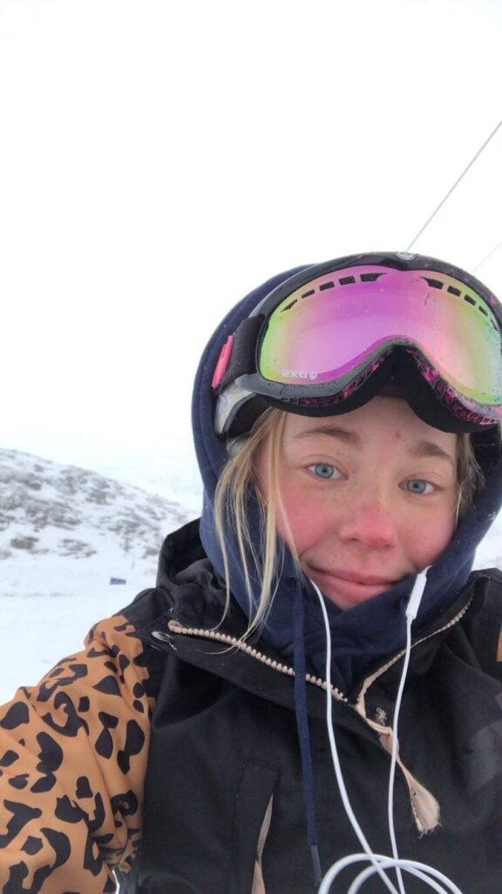
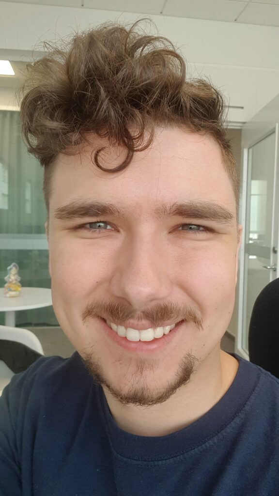

Idag ska alla SnOrdfar få presentera sig och vad de gör.

- 
    
- 
    

_Beskriv dig själv samt D-SnOrdfs uppgifter_

Hejhej!

Anton heter jag, är 23 år gammal och kommer ursprungligen från Stockarnas holm (otippat). Just nu är jag inne på mitt fjärde år på D-programmet, och sitter just nu som Studienämndsordförande för D-programmet 22/23. Detta är alldeles för jobbigt att skriva, så vidare i denna text kommer jag bara kalla detta för D-SnOrdf (lite skönare att uttala också!).

Som D-SnOrdf så har man sammanfattningsvis ansvar för att se till att D-programmets kurser håller hög kvalitet, och ser till att lyfta upp synpunkter från studenter samt se om dessa uppföljs.

Rent praktiskt yttrar sig detta i en del arbetsuppgifter under läsårets gång, såsom att rekrytera representanter från varje D-klass samt se till att de utvärderingar som dessa gör med sina klasser genomförs på ett bra sätt.

Vidare så är man även med i en del möten med en del olika grupper, både med folk från universitetsnämnder och med andra TekFak-SnOrdfar/LinTek, där man kan diskutera studenternas synpunkter och även få lyfta sina egna åsikter om diverse punkter!

Som D-SnOrdf sitter man även med i Utbildningsutskottets styrelse tillsammans med resten av sektionens SnOrdfar (och vår fine UtbU-ordförande!), och samarbetar med dessa många frågor såsom samutvärderingar & event som pluggstugor (vi ses väl på nästa?)!

_Vad fick dig att söka D-SnOrdf?_

De tidigare två läsåren har jag suttit som klassrepresentant i UtbU, och i våras kändes det rätt naturligt att gå vidare till SnOrdf-posten då jag var lite trött på att släpa fika till utvärderingstillfällen & skriva massa utvärderingsdokument. Jag var helt enkelt lite sugen på att få mer insyn på hur universitet & kåren arbetade just inom studiebevakningen, och vad sektionens medlemmar tycker om kurserna!

_Vad har varit det roligaste med att vara D-SnOrdf?_

Det roligaste att vara D-SnOrdf är att medverka på alla dessa möten med universitet/kåren, även om de kan vara lite sega att gå på ibland så har det fått mig att inse hur mycket vi studenter kan påverka vår utbildning (vilken är typ lite viktig?). Man har ju tidigare hört att man kan påverka sin utbildning genom att gå på utvärderingar/kontakta en SnOrdf, men efter jag varit med på universitetsmöten där man varit med och tagit fram förbättringsförslag så har den möjligheten blivit ännu mer konkret för mig!

Sedan har det varit väldigt kul med allt samarbete jag varit med i, både med övriga UtbU-styret samt med andra TekFak-SnOrdfar, det har funnits mycket att lära sig från dessa (och har dessutom varit extremt skönt häng)!

_Behöver man någon tidigare erfarenhet för att vara D-SnOrdf?_

Jag skulle väl rekommendera att man läst D-programmet i några år innan man börjar som D-SnOrdf samt att man varit klassrepresentant någon gång tidigare eftersom det är en del nytt att sätta sig in i när man börjar posten, och då kan det vara skönt att redan ha koll på ex. hur utvärderingarna går till eller hur kurserna som utvärderas har uppfattats tidigare år.

Dock är detta inga starka krav i min mening utan allt går att lära sig innan man påbörjar sitt läsår (samt under), men är fortfarande något jag rekommenderar då jag kan tänka mig att det kan bli lite mycket nytt att lära sig på en gång annars.

_Har du något mer du vill tillägga?_

SÖK, det blir faktiskt jättekul kan jag lova! Som sagt kan det vara lite mycket att sätta sig in i början, men när man väl kommit igång så rullar det på som smort!

Givetvis går det bra att hugga tag i mig ifall man behöver hjälp innan/under läsåret.

Det finns några detaljer jag lämnat ute ur denna text för att hålla det (något) koncist, så om det är något du undrar om posten så är det bara att pinga mig i valfri kommunikationskanal!

* * *

_Beskriv dig själv samt U-SnOrdfs uppgifter_

Jag heter Joline Hellström, är 23 år och kommer ursprungligen från Övik. Innan jag kom hit spelade jag en hel del fotboll och sedan jag kom hit har jag engagerat mig i lite allt möjligt såsom exempelvis Donna och FIA (skolans robotförening). När jag inte sitter och pluggar tycker jag om att vara ute och traska eller (om det finns snö), åka snowboard :) Min posts uppgifter är att ansvara för att utvärderingar görs och skickas in samt att representera studenterna i olika forum såsom ProgramPlaneGruppen (PPG) och nämnden.

_Vad fick dig att söka U-SnOrdf?_

Jag tycker att utbildningen är viktig och ville få vara med och göra den ännu bättre!! Jag tycker att det är viktigt att studenter får vara med och säga och tycka till om utbildningen och personligen tycker jag om att diskutera sådant så jag tänkte att posten skulle passa mig bra!

_Vad har varit det roligaste med att vara U-SnOrdf?_

Det roligaste har varit att sitta med på PPG och nämndmöten. Jag upplever att examinatorer och de ansvariga för programmen lyssnar på det jag har att säga på mötena vilket gör att det är väldigt kul att sitta med!

_Behöver man någon tidigare erfarenhet för att vara U-SnOrdf?_

Nej! Förutom att det är bra att ha gått många av de kurser som U har i år 1-3.

* * *

_Beskriv dig själv samt IT-SnOrdfs uppgifter_

Bland det första som görs är att rekrytera klassreppar. Utöver det sitter UtbU-styret i möte ett par gånger i månaden och diskuterar hur sektionen kan förbättras samt planerar pluggstugor och lite evenemang för UtbU. Man sitter även med på PPG-möten med lärare från sin linje och tar upp studenternas frågor/önskemål.

_Vad fick dig att söka IT-SnOrdf?_

Har varit klassrepp innan och tyckte att SnOrdf-rollen lät rolig.

_Vad har varit det roligaste med att vara IT-SnOrdf?_

Kul människor att hänga med och roligt att känna sig delaktig i sektionen.

_Behöver man någon tidigare erfarenhet för att vara IT-SnOrdf?_

Det underlättar betydligt om man har varit klassrepp, då man får en bra grundkoll på kursutvärderingarna och hur det går till.

_Har du något mer du vill tillägga?_

Känns som att det är meriterande att vara ganska strukturerad, då det är relativt mycket datum och annat som behöver hållas koll på och få ut till klassrepparna i tid.

* * *

_Beskriv dig själv samt IP-SnOrdfs uppgifter_

Jag heter Jim, pluggar IP3 och har varit (och är) IP SnOrdf i år.

Som SnOrdf har jag som uppdrag att vara länken mellan IP studenterna och dom bestämmande organen på LiU och specifikt Data och Media nämnden. Jag är också ansvarig för att organisera och hjälpa mina klassreppar i IP klasserna.

Posten innebär mycket administrativt arbete så som att gå på möten, svara på mail, skicka mail och planering. Det är också mitt ansvar att i slutändan föra fram den feedback som studenterna ger på kurser och eventuella kommentarer de har under kursernas gång.

_Vad fick dig att söka IP-SnOrdf?_

Jag sökte IP SnOrdf eftersom att posten var vakant och det är alltid bättre att ha någon än ingen på posten. Även att bara gå på mötena som representant för IP är en viktig del för att få fram vårt programs åsikter och önskningar. Jag tror även starkt på UtbUs uppdrag som ansvarig för den allmänna förbättringen av alla våra program, för både framtida och nuvarande studenter.

_Vad har varit det roligaste med att vara IP-SnOrdf?_

Det roligaste med att vara SnOrdf är att träffa människorna som programmet och dess ledning består av! Att ha klassreppar är ett utmärkt sätt att få lite mer kontakt mellan de olika åren och att få träffa de som bestämmer om programmet är ofta även det en givande upplevelse där man har stor chans att påverka.

_Behöver man någon tidigare erfarenhet för att vara IP-SnOrdf?_

Att studera på IP programmet är en rätt bra början.

Utöver det skulle jag inte säga att det finns några hårda krav, men det är verkligen en fördel att innan ha varit klassrepresentant så att man vet vilket arbete som behöver utföras av de som du är ansvarig för, det blir lätt rörigt annars. Därtill är alla erfarenheter inom organisationer och kalenderdrivna entiteter väldigt fördelaktigt.

* * *

_Beskriv dig själv samt Master-SnOrdfs uppgifter_

Mitt namn är Victor och jag pluggar 4:e året på datateknik. Som master-snordf organiserar man linteks kursutvärderingar på masternivå. Man sammarbetar mycket med profilrepresntanterna som man väljer ut i början av uppdraget, samt med resten av Utbu-styret.

_Vad fick dig att söka Master-SnOrdf?_

Även om det är en förtroendevald post så är det inte supermycket arbete mestadels, vilket jag tyckte var skönt då jag samtidigt hade andra uppdrag. Men samtidigt så är det en ledarroll vilket var något jag ville testa på!

_Vad har varit det roligaste med att vara Master-SnOrdf?_

Det roligaste har varit att lära känna och arbeta med Utbu-styret och profilrepresntanterna som jag valde ut!

_Behöver man någon tidigare erfarenhet för att vara Master-SnOrdf?_

Det behövs ingen speciell erfarenhet, men det kan underlätta om man själv pluggar masterkurser.
