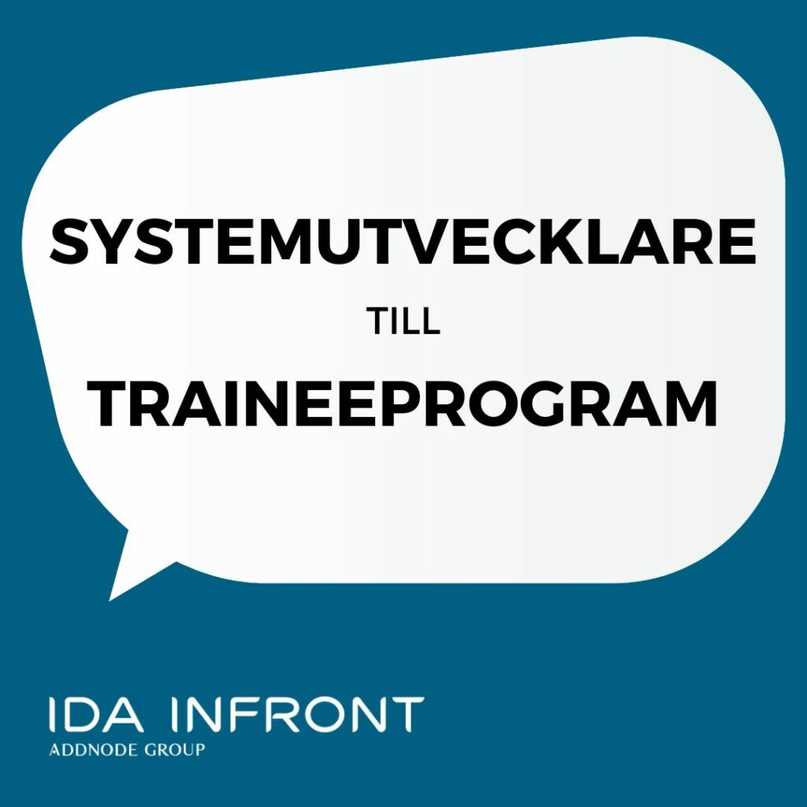

När traineeprogrammet startar anställs du som Software Developer med placering på vårt kontor i  
centrala Linköping. Programmet löper under fyra månader med start i september 2023. 
⚫⚫ Fas 1: Välkommen ombord  
Du får möjlighet att lära känna verksamheten, arbetssätten och processerna. Vi ger dig en gedigen  
utbildning i alla de faser som ingår i utvecklingen av vår produkt, iipax, och du kommer arbeta  
tillsammans med de andra traineerna för att lösa olika case.  
⚫⚫ Fas 2: Möt ditt nya team  
Från din första dag kommer du att tillhöra ett team samt ha en dedikerad mentor som är med dig  
genom hela traineeprogrammet.  
⚫⚫ Fas 3: Testa vingarna  
När grundutbildningen är klar vill vi involvera dig i teamets riktiga projekt.  
⚫⚫ Fas 4: Grattis – du är en Idait!  
Efter traineeprogrammet arbetar du som fullstackutvecklare i ditt redan kända team. Tillsammans  
arbetar ni för att förverkliga de krav som ställs på den kundlösning ni utvecklar.

