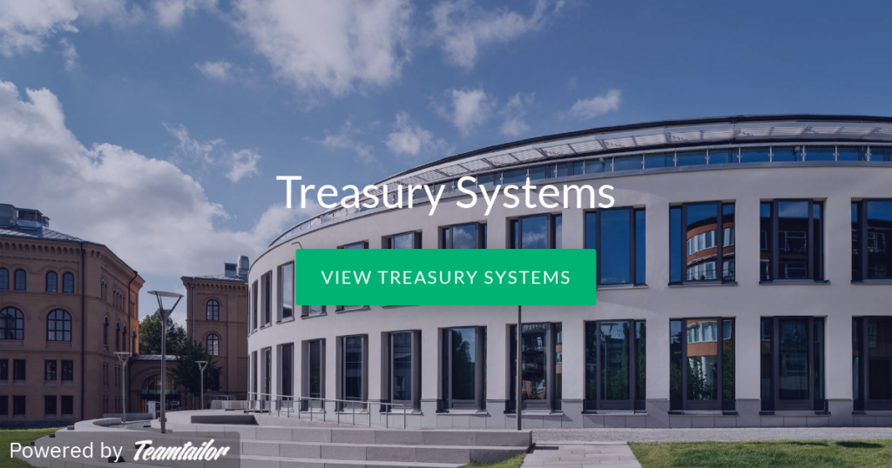

[](https://l.facebook.com/l.php?u=https%3A%2F%2Fcareer.treasurysystems.com%2F%3Ffbclid%3DIwAR05TKWO8DQVb5jENwNoxuc71vaaqGGXWijxi126HHHyJR5nsWyV-eDRh18&h=AT1o0usZrTLVYeNHJ6_m04MziCnmcARBlIu8Mit-waer1_auaeH5ER809cwhvU4CC2xXmhq8FEEg_6XjAL8P1LdEaRjww1ExQZoLn1XoawoV1x-TTWNUK4a9XHK-bgmctcbX2ogXkRMS-y6MvW_K&__tn__=-UK-R&c[0]=AT3ai-rnPFGlRciJpgeHATHwAQPfSesZcQrqsLEIIphfjdolAAE7C3Ctzsb-5wkrKY6Yz5Fn-8WBbeFzp_d2Pf3H8FKmLvryS3LkNfaAIEj3-pKc1E2HymMLT6JdXZMW6BhOlhFhgz2TRMIqvWaVW-ZHWZxe2IhCzCQqyWlpkBr_lVnkVB3XcnvlZRn9kmg2O-AhUvgshayEQxfjUw)

Vi söker nu fler utvecklare för att fortsätta bygga ut och underhålla vår framgångsrika fintech produkt som vi släppte för några år sedan. Vi är redan ledande i norden men vill nu bli större!

I rollen som utvecklare hos Treasury Systems kommer du att utveckla i C#. I din roll fokuserar du på att nyutveckla och förbättra befintlig funktionalitet i vår produkt, som driftas i Azure. Du kommer att vara med i hela arbetsprocessen som innefattar krav, design och programmering. Hos oss får man alltid en mentor i början och därefter snabbt ansvar att driva sina ärenden vidare, med teamet som bollplank. Vi jobbar agilt med versionssläpp var 3 vecka, så din kod kommer snabbt ut till slutanvändaren!

Vi har anställt flera från d-sektionen (bl.a. vår lead architect) under åren och vet vilken grym potential ni besitter! Så se till och ansök på  [https://career.treasurysystems.com/](https://career.treasurysystems.com/) , vi har kontor både i Linköping & Stockholm.
