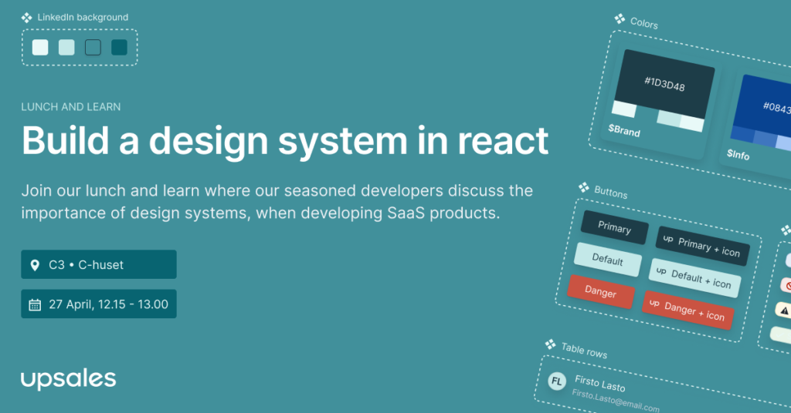

Vill du lära dig mer om webbgränssnitt och att kunna skriva "clean code" så vill du inte missa denna Lunch & Learn med Upsales. I samarbete med Näringslivsutskottet bjuder Upsales på en lunchföreläsning där vi kommer prata om hur du kan bygga ett designsystem i React.

  
NÄR? Datum: 27/4 12:15 - 13:00  
VAR? C3 (C-huset)  
KRUBB? Wraps till de 50 första som anmäler sig!!

Anmälningsformulär för Lunch:  
[https://pages.upsales.com/15882u42ff5a514f1f44228210765312c6e4fd?utm\_source=facebook&utm\_medium=paidsocial&utm\_campaign=Lunch%20%20Learn%20med%20Upsales&utm\_term=dsektionen](https://pages.upsales.com/15882u42ff5a514f1f44228210765312c6e4fd?utm_source=facebook&utm_medium=paidsocial&utm_campaign=Lunch%20%20Learn%20med%20Upsales&utm_term=dsektionen)

Detta event använder sig av D-sektionens pricksystem, info hittar du här:  
[https://d-sektionen.se/wp-content/uploads/2022/02/Policy-for-avanmalan.pdf](https://d-sektionen.se/wp-content/uploads/2022/02/Policy-for-avanmalan.pdf)  
Du finner även D-sektionens policy kring datahantering här:  
[https://d-sektionen.se/wp-content/uploads/2018/05/Policy-datahantering-D-sektionen.pdf](https://d-sektionen.se/wp-content/uploads/2018/05/Policy-datahantering-D-sektionen.pdf)  
Sista dagen för anmälan och avanmälan är 24:e April kl 23.59
