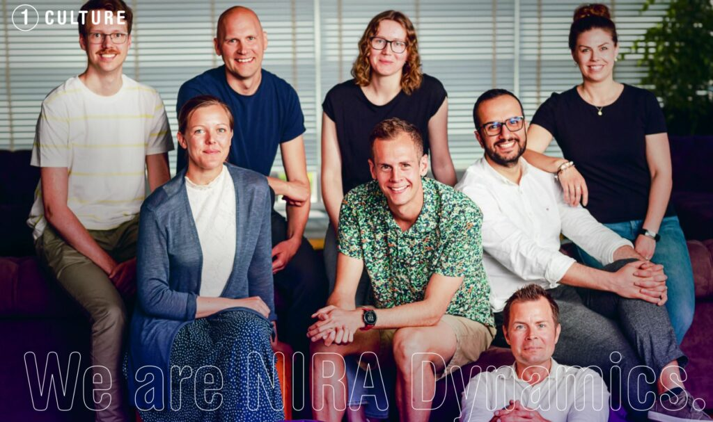

Kom och käka lunch och lyssna på hela NIRA-storyn, från starten 2002 till kommande års roadmap för embedded- och molnbaserade produkter inom fordons- och infrastrukturområdet. Vad är det för tjänster och produkter företaget utvecklar och leverarar? Hur är kulturen och vilka roller och karriärmöjligheter finns det för D:are på NIRA?

Häng gärna kvar en stund efteråt för frågor och discussion!

Vill du veta mer? Besök [https://niradynamics.se/culture/](https://niradynamics.se/culture/) redan innan föreläsningen.

**About NIRA**

We at NIRA believe in making roads safer by developing sophisticated software solutions for passenger cars.  Customers include some of the world’s leading car manufacturers, such as Audi, Volkswagen, Geely, Seat, Skoda, Volvo and Renault. With over 130 co-workers, global presence and software running in over 80 million vehicles, NIRA Dynamics is a worldwide industry leader in its segment. 

You are welcome to NIRA for who you are, no matter where you come from or what kind of mode of transportation you prefer. Our work on future services focus on all modes of transportation for everyone, and so is our workplace. The more diverse experience we have, the more brilliant we will be in charging towards a sustainable transportation system.

**NÄR?** Torsdag 4 maj kl 12:15-13:00

**VAR?** C2 (i C-huset)

**MAT?** Mackor från Subway till de 100 första som anmäler sig!

**Anmäl dig här:** [https://forms.gle/LySQ3m7QCJCUesQT9](https://forms.gle/LySQ3m7QCJCUesQT9)

Detta event använder sig av D-sektionens pricksystem, info hittar du här:  
[https://d-sektionen.se/wp-content/uploads/2022/02/Policy-for-avanmalan.pdf](https://d-sektionen.se/wp-content/uploads/2022/02/Policy-for-avanmalan.pdf)  
Du finner även D-sektionens policy kring datahantering här:  
[https://d-sektionen.se/wp-content/uploads/2018/05/Policy-datahantering-D-sektionen.pdf](https://d-sektionen.se/wp-content/uploads/2018/05/Policy-datahantering-D-sektionen.pdf)  
Sista dagen för anmälan är tisdag 2 maj kl 23:59.

Eventuell avanmälan görs även senast tisdag 2 maj kl 23:59, till [max.naru@d-sektionen.se](mailto:max.naru@d-sektionen.se)

