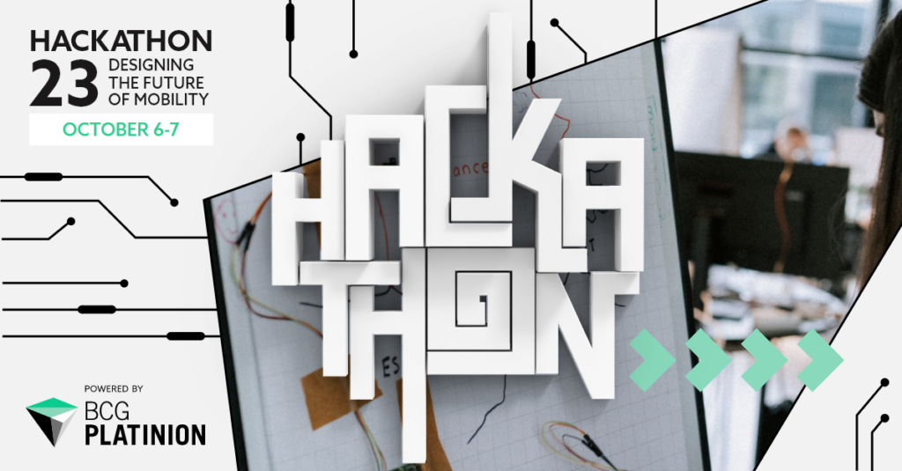

Calling all tech-savvy innovators! Coming October, BCG Platinion invites you to their annual flagship event, the BCG Platinion Hackathon 2023.  

Mark your calendars for an unforgettable two-day experience on October 6-7 in Düsseldorf, Germany, competing with teams from around the globe! The goal is to create cutting-edge solutions in line with this year’s Hackathon theme – the future of mobility, revolutionizing how we move and connect.  

Gain industry insights, meet their experts, have fun, and be part of something extraordinary!  

Ready to get your hands on coding? **Apply by September 10 to save your spot:** [https://hackathon.bcgplatinion.com/](https://protect-us.mimecast.com/s/fOQ4Cqx2JwS1GpWWAhQyd5b/) All travel arrangements and event-related costs are covered by BCG Platinion.  

Let's redefine the future of mobility together! 

