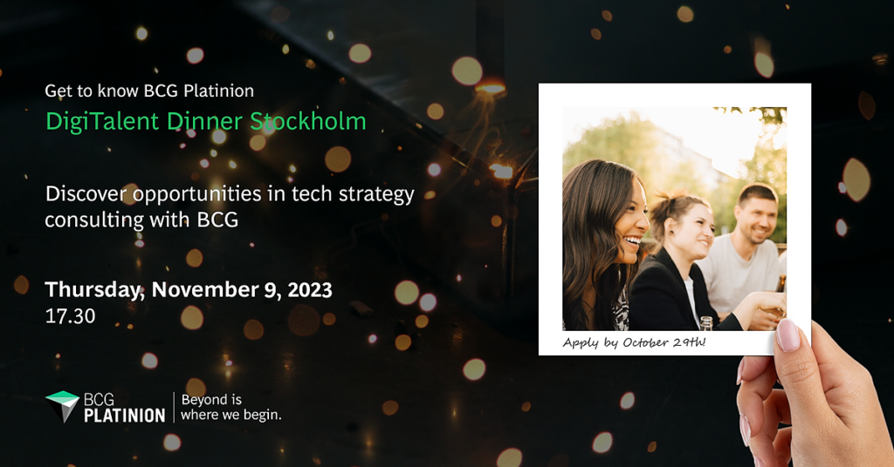

> An insightful Thursday evening awaits: discover tech strategy consulting in a relaxed dinner setting! 
> 
> BCG Platinion invites all students with a passion for technology to meet them in Stockholm! 
> 
> BCG Platinion is part of Boston Consulting Group (BCG) with a focus on strategic tech advisory. They advance the tech agenda of their global clients by supporting them toward a successful digital future. 
> 
> On November 9, you get to dive into the world of management consulting with a tech twist and uncover international career opportunities that could await you. All while getting to know BCGers and other tech-interested participants! 
> 
> The evening will be kicked off at the BCG office in central Stockholm with a company presentation, including detailed case examples and insights into entry-level career opportunities. This will be followed by a dinner at a nearby restaurant to continue discussions and make sure you get all of your questions answered. 
> 
> Caught your interest? Make sure to apply by October 29 to secure your spot. Follow this link for further details: [https://on.bcg.com/digitalent2023](https://on.bcg.com/digitalent2023)  
> 
> Travel expenses from other parts of Sweden to Stockholm will be covered by BCG Platinion.
