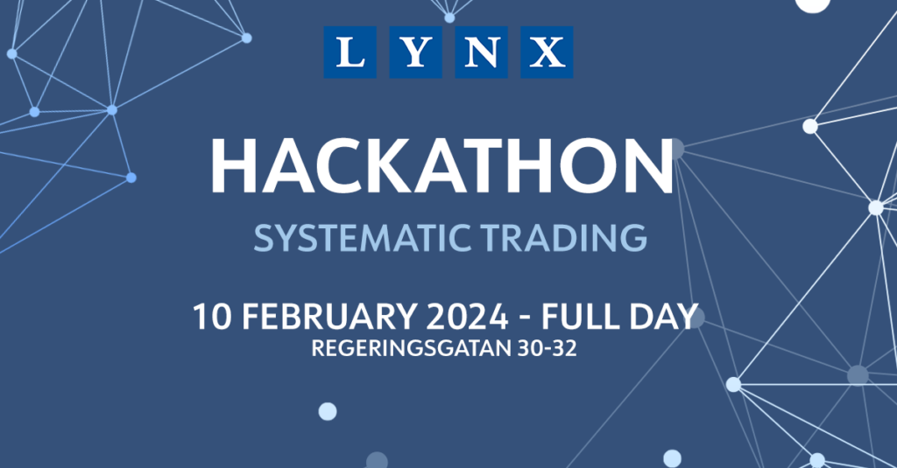

At the Lynx Hackathon, you will work in teams to create a fully systematic trading strategy based on real market data. Your algorithm will be evaluated in a virtual environment at the end of the event, allowing you to see how your idea would have worked in the real financial market.  There will be investment professionals from our research and trading department at your disposal to answer questions and guide you through the process. After the event, there will be dinner and mingle at the office!  For more information and how to apply, go to our website [www.lynxhedge.se/hackathon](http://www.lynxhedge.se/hackathon). The website will open for application 1st of December.

