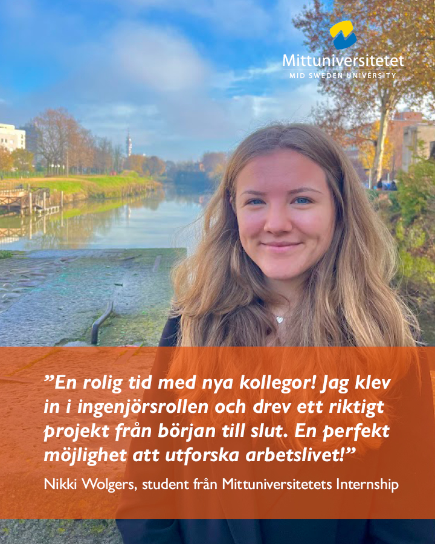

Läser du tredje eller fjärde året på en civilingenjörsutbildning? Sök Mittuniversitetets internship sommaren 2024. Under åtta veckor är du anställd på ett företag eller en myndighet för att hitta lösningar på skarpa uppdrag. Du får en kickstart på din karriär! Läs mer om uppdragen på, [Sökbara uppdrag sommaren 2024 | miun.se](https://www.miun.se/utbildning/civing/internship/sokbara-uppdrag-2024/)  **Sök senast 31 januari!**

MIUN Internship i korthet:  
12 sökbara uppdrag hos olika uppdragsgivare  
Jobba i Sundsvall, Kramfors, Örnsköldsvik  
Du är anställd och får lön av din uppdragsgivare  
Parallellt läser du kursen Design Thinking 7,5 hp

**Läs mer på [miun.se/internship](http://miun.se/internship)  
**Välkommen med din ansökan!

Länk till ansökan: [Sökbara uppdrag sommaren 2024 | miun.se](https://www.miun.se/utbildning/civing/internship/sokbara-uppdrag-2024/)

