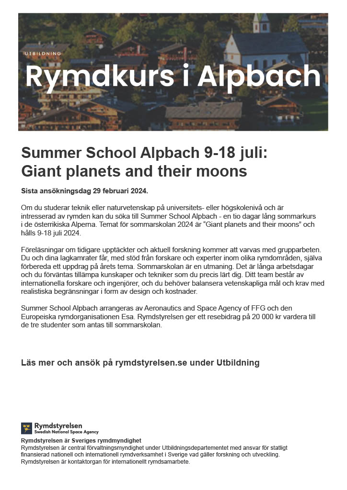

<!--more-->

**Summer School Alpbach 9-18 juli: GIANT PLANETS**

Sista ansökningsdag 29 februari 2024.

Om du studerar teknik eller naturvetenskap på universitets- eller högskolenivå och är intresserad av rymden kan du söka till Summer School Alpbach - en tio dagar lång sommarkurs i de österrikiska Alperna. Temat för sommarskolan 2024 är “Giant planets and their moons” och hålls 9-18 juli 2024.

Föreläsningar om tidigare upptäckter och aktuell forskning kommer att varvas med grupparbeten. Du och dina lagkamrater får, med stöd från forskare och experter inom olika rymdområden, själva förbereda ett uppdrag på årets tema. Sommarskolan är en utmaning. Det är långa arbetsdagar och du förväntas tillämpa kunskaper och tekniker som du precis lärt dig. Ditt team består av internationella forskare och ingenjörer, och du behöver balansera vetenskapliga mål och krav med realistiska begränsningar i form av design och kostnader.

Summer School Alpbach arrangeras av Aeronautics and Space Agency of FFG och den Europeiska rymdorganisationen Esa. Rymdstyrelsen ger ett resebidrag på 20 000 kr vardera till de tre studenter som antas till sommarskolan.

Läs mer och ansök på [rymdstyrelsen.se](http://rymdstyrelsen.se/) under Utbildning
