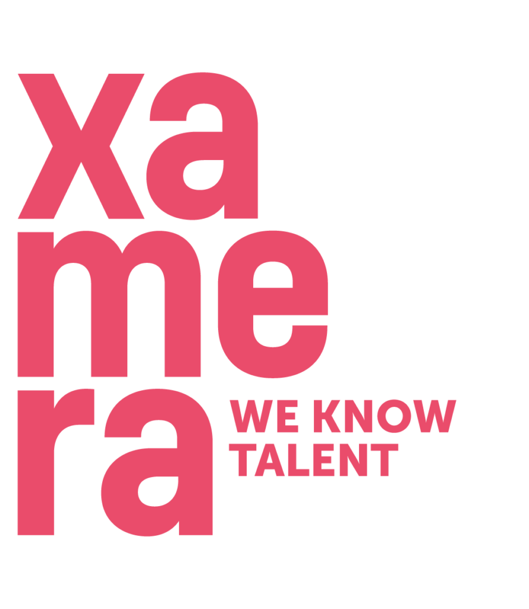

Tar du examen till sommaren och är på jakt efter jobb? Boka in ett karriärsamtal med Xamera och klara av hela ditt jobbsökande på 30 min! De matchar kompetens med rollbeskrivning & personlighet med företagskultur.

Anmälan till eventet: [https://fb.me/e/70SjA3alh](https://fb.me/e/70SjA3alh)

Anmälan till karriärsamtal: [https://forms.gle/9xCbh1wPprnQH62a8](https://forms.gle/9xCbh1wPprnQH62a8)

De tolv första som anmäler sig garanteras karriärsamtal under eventet! Obs gäller endast dig som tar examen 2024.

<!--more-->

Den 11 mars kommer NärU, UtbU och Xamera AB anordna ett frukostevent i skrivsalen och de tolv första som anmäler sig kommer garanteras karriärssamtal redan samma dag! Detta gäller studenter som tar examen 2024.

Xamera kommer att vara med under frukosteventet för att mingla runt och inte minst erbjuda karriärsamtal på plats!

Xamera är experter på att matcha intressanta företag med juniora talanger. De vill hjälpa nyexade studenter att välja rätt jobb och samtidigt förenkla och förbättra matchningen i anställningsprocessen. Du har investerat flera år av ditt liv på en utbildning, riskera den inte genom att hamna på fel jobb. Xamera erbjuder skräddarsydda matchningar som startar med ett karriärsamtal, och detta kan du få ta del av på eventet! Linköping, Stockholm, Göteborg, Malmö? De hjälper dig dit du vill!

Under eventet ges du nämligen möjlighet att träffa en av Xameras rekryterare genom att i förhand boka in ett karriärsamtal! Under karriärsamtalet pratar ni om dina önskemål och preferenser; vad som är viktigt för dig på en arbetsplats, bransch, storlek på företag, drömjobb och så vidare. Därefter matchar de dig mot alla deras karriärmöjligheter och ser till att du får komma på intervju hos de företag som passar dig allra bäst. Xamera finns med och coachar under hela rekryteringsprocessen och skräddarsyr ett erbjudande som passar dig perfekt! Hur bra?

Om du är sugen på att veta mer om Xamera, kom förbi och tveka inte att ställa alla eventuella frågor!

