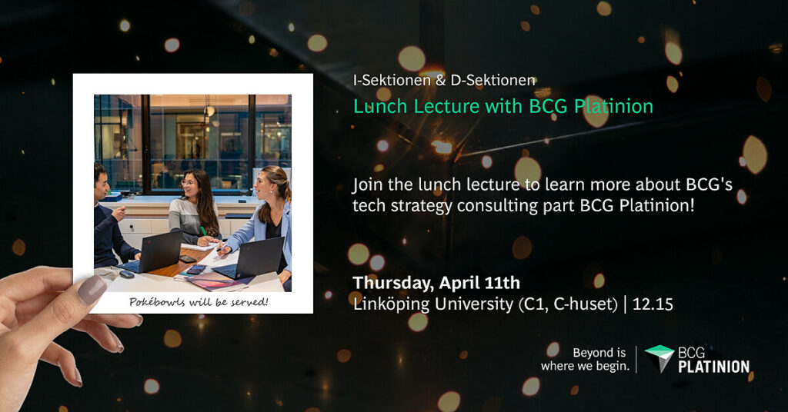

Students with a passion for tech – mark your calendars with April 11th!

<!--more-->

  
Join the lunch lecture for I-Sektionen and D-Sektionen on Thursday, April 11th at 12.15 at Linköping University (C1, C-huset) to learn more about BCG’s tech strategy consulting part BCG Platinion!

  
BCG Platinion, part of the leading management consulting firm Boston Consulting Group (BCG), bridges the gap between business and technology and advises the senior leadership of clients on their tech agenda towards a successful digital future.

  
Over lunch, you get insights into the company, the client cases they typically work on and their entry-level career opportunities. In addition, the company representatives from BCG Platinion are happy to address any questions you may have.

  
The lecture will be held in English, and Pokébowls for the first 160 people will be served. Hope to see you there!

Registration: [https://docs.google.com/.../1Ien78PEd3Qk07C35CSWNQnu.../edit](https://docs.google.com/forms/d/1Ien78PEd3Qk07C35CSWNQnurUl8teYhgrmk_s6TM2p8/edit?fbclid=IwAR2nYRQjsXHEH_w64WvEfdPtOyiix6_Ug6MPUKzHtIG0L8OierlnNeY7kD4_aem_AR4Ve3xZrFds9esaC5vSvuVKOB426XdBab-t4_2D2ovz1WbcFOSVTYjHIYQYauLumwLwOURzZ8SO9zk_xi-T-FgX)
