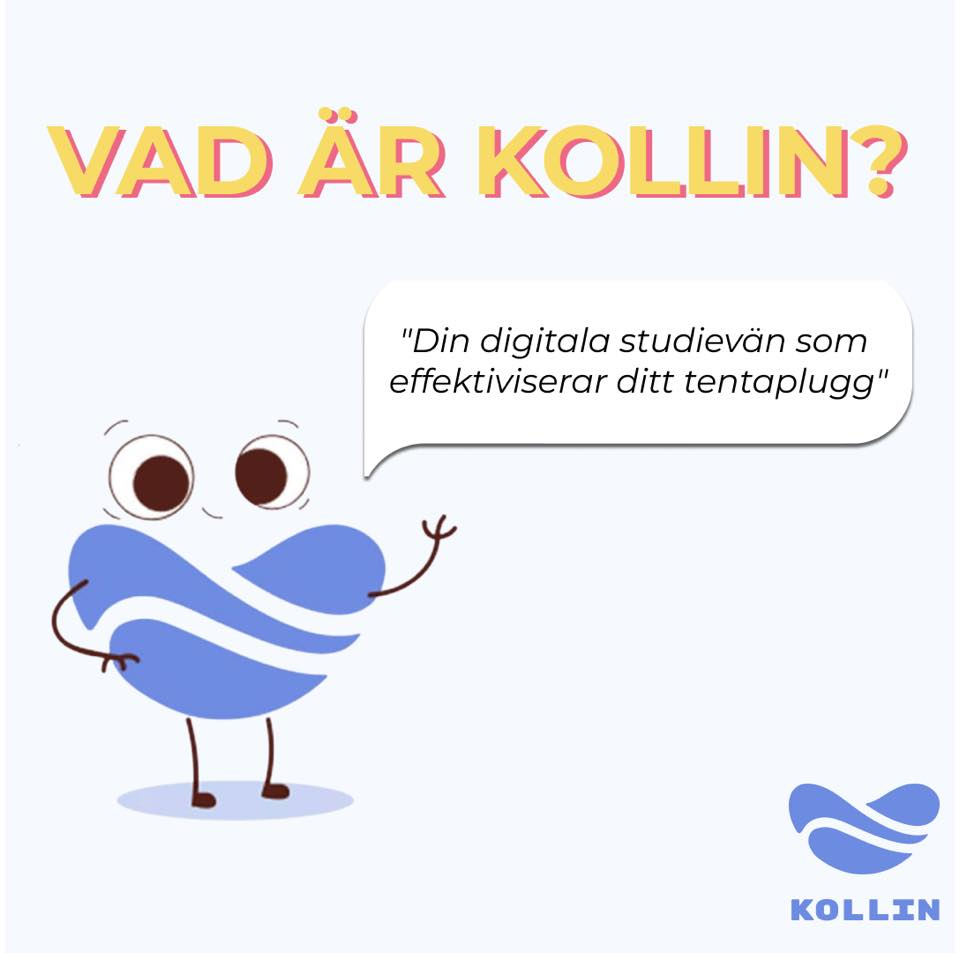

Länk: [http://kollin.io/join/data-liu](http://kollin.io/join/data-liu)

Kollin är en innovativ plattform, skapad av teknologer för teknologer. Plattformen är designad för att göra ditt studieliv enklare, effektivare och roligare! Med en skräddarsydd samling av tentor, modulindelade uppgifter och lösningar blir pluggandet en bris! Du kan spåra dina framsteg, så att du alltid ligger steget före!

Sitter du hemma och pluggar tentor själv och inte har någon att fråga? Använd då Kollin GPT som kan ge tips, lösningar eller generera nya uppgifter med nya siffror. Det går även att använda diskussionsforum för att hjälpa varandra på uppgifter eller generella frågor kring olika kurser.

Med Kollin Share kan medlemmar på D-sektionen dela egna dokument inom sektionssidan på Kollin och kategorisera dem beroende på vilken typ av dokument det är. Genom att dela egenskrivna tentor, tentatips eller föreläsningsanteckningar kan studenter sprida kunskap och hjälpa varandra att samla allt kursmaterial på en och samma plats som är kategoriserad och strukturerad.

