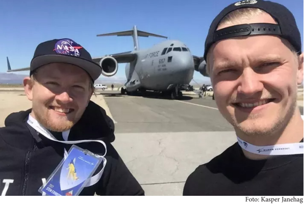

**Sista ansökningsdag 16 maj 2024**

Rymdstyrelsen samarbetar med National Aeronautics and Space Administration (NASA) i USA om att ge två svenska studenter möjlighet att delta i NASA:s International Internship Program.

Rymdstyrelsen står för kostnaden för själva praktikplatsen (tuition). Studenten betalar själv övriga kostnader som resa mat, logi och visum. Terminen är ca 16 veckor lång och startar i januari 2025.

**För att kunna ansöka:**

• Vid tiden för praktikperioden måste du vara student på kandidat- eller magisternivå inom något av områdena: Science, Technology, Engineering eller Mathematics.

• Du måste ha snittbetyg motsvarande 3,0 i det amerikanska systemet. Det motsvarar ungefär C i svenska betygsystemet efter 2011. Du behöver inte sammanställa detta på egen hand utan bifogar ditt Ladok-utdrag i ansökan.

• Du ska visa på intresse inom rymdområdet.

• Du ska besitta goda kunskaper i engelska.

• Du måste vara svensk medborgare.

**Läs mer och ansök på [rymdstyrelsen.se](http://rymdstyrelsen.se) under Utbildning.**

###   
Tidplan

·         Ansökan öppnar 16 april 2024 och stänger den 16 maj 2024

·         Första urvalet av kandidater är klart i juni/juli 2024.

·         Nasa ger besked i oktober/november 2024.

·         Praktiken startar i januari/februari 2025.

[Läs mer och gör din ansökan, som skrivs på engelska, här.](https://www.rymdstyrelsen.se/contentassets/5a115869393342a79566640c3314bc9a/application-for-nasa-internship-2025.pdf)  
[https://www.rymdstyrelsen.se/utbildning/utlysningar/aktiva-utlysningar/nasa-praktik-varen-2025/](https://www.rymdstyrelsen.se/utbildning/utlysningar/aktiva-utlysningar/nasa-praktik-varen-2025/)
