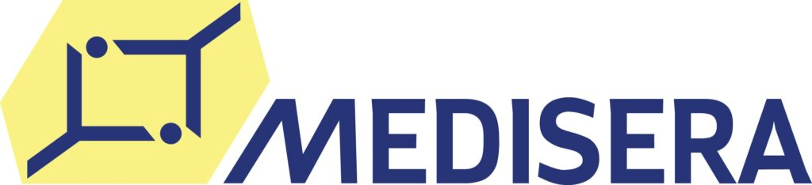

Medisera söker dig som gillar teknik och webbutveckling, och som kommit en bit på vägen i din utbildning. Vi behöver din hjälp i arbetet med vår webbplats och vårt intranät. Specifikt behöver du:

<!--more-->

\- Goda kunskaper inom backendutveckling  
\- God förståelse för relationsdatabaser (SQL)  
\- Backend: PHP, NodeJS, C#  
\- Databaser: MySQL/MariaDB, MongoDB  
\- CMS: WordPress

Vi tror att vi har god förståelse för att utvecklingsarbete inte kan stressas fram och att det kräver god planering. 

Vi ser gärna att du kan lägga 8-16 timmar per vecka eller mer och du behöver inte sitta på något av våra kontor (huvudkontor i Linköping) även om vi tycker att det är trevligt att träffas ibland.

Välkommen att skicka din ansökan till [info@medisera.se](mailto:info@medisera.se)!

