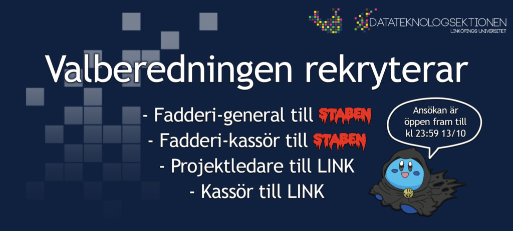

Tiden är kommen! Äntligen har ansökan till General/Kassör för STABEN 2025 och snart Projektledare/Kassör till LINK 2025 öppnat. Vi i Valberedningen söker just nu en General och en Kassör till nästa års STABEN. En Projektledare och en Kassör till LINK söker vi tillsammans med Y-sektionens Valberedning.

Så är du taggad på att leda en grupp STABAR genom deras livs äventyr? Eller kanske se till att ekonomin går runt under tiden? Är du taggad på att ge Nollan ett oförglömligt Nolle-P? Sök till STABEN General eller STABEN kassör.

Vill du planera nästa års LINK och leda en stor grupp? Ha koll på alla företag som kommer på LINK och se till att ekonomin går ihop? – Då ska du ta chansen att söka LINK General eller LINK kassör.

Postbeskrivningar hittar du på [https://d-sektionen.se/postbeskrivningar-hostemote/](https://d-sektionen.se/postbeskrivningar-hostemote/)

Känner du att någon av posterna lockar dig, eller vet du kanske någon som passar perfekt? Då vi har samarbete med Y-sektionen för LINK val så finns det två länkar till de olika posterna. Så gå in på formulären nedan för att ansöka/nominera:

[Ansökan och nominering STABEN](https://forms.gle/T9WcCZAtso92Xxqg7)

[Ansökan och nominering LINK](https://forms.gle/JK1f9pgGiaWXE9nC6)

Har du några frågor så var inte rädd för att maila oss på [val@d-sektionen.se](mailto:val@d-sektionen.se) eller skriva till de nuvarande sittande på posterna för mer postspecifika frågor:

STABEN General: [general@staben.se](mailto:general@staben.se)  
STABEN Kassör: [kassor@staben.se](mailto:kassor@staben.se)

LINK Projektledare: [projektledare@linkdagarna.se](mailto:projektledare@linkdagarna.se)  
LINK Kassör: [kassor@linkdagarna.se](mailto:kassor@linkdagarna.se)

Ansökan för STABEN och LINK är öppen fram till kl 23:59 den 13:e oktober och intervjuerna kommer att ske löpande, så passa på och sök eller nominera!
