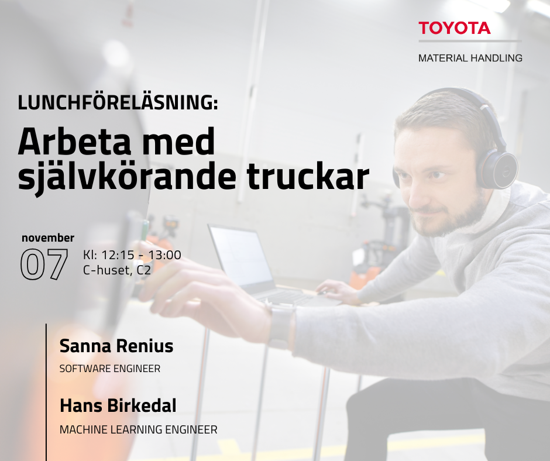

Är du nyfiken på hur det är att arbeta med den senaste tekniken inom ett globalt företag? Kom och lyssna på Sanna och Hans från Toyota Material Handling! De kommer att ge en spännande inblick i företagets innovativa arbete och hur det är att vara utvecklare hos dem. Du får höra om deras erfarenheter av att arbeta i dynamiska team, hantera självkörande gaffeltruckar och använda den senaste tekniken i en verklig miljö. Dessutom får du en översikt över en typisk arbetsdag på R&D inom Toyota Material Handling. Missa inte chansen att få en unik inblick i en framtid inom logistiksektorn!

Vart: C2, Chuset

När: 7 november, 12:15 - 13:00

Vi kommer att bjuda på sushi och dryck till ett begränsat antal platser och det är först till kvarn som gäller så anmäl er i formuläret nedan snabbt!

[https://forms.gle/oYoLJiubgHv5LTwGA](https://forms.gle/oYoLJiubgHv5LTwGA)

