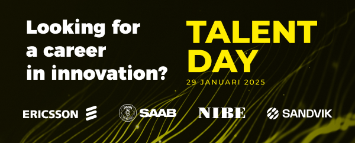

Tillsammans med sina partners Ericsson, Saab, NIBE och Sandvik bjuder Tekniska museet in dig till ett rekryteringsevent

Välkommen till Talent Day, ett unikt alternativ till traditionella arbetsmarknadsmässor. Möt några av världens mest innovativa företag, som ofta rankas som topparbetsplatser bland studenter, på djupet. Du även kan vinna en time av personlig coachning med en av deras partners.

När: 29 januari 9.00-14.00  
Var: Tekniska museet, museivägen 7, 115 27 Stockholm

Läs mer och anmäl er här: [https://www.tekniskamuseet.se/talent-day/](https://www.tekniskamuseet.se/talent-day/)

