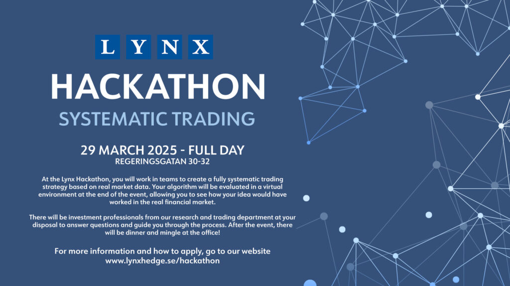

På Lynx Hackathon kommer du att arbeta i team för att skapa en helt systematisk handelsstrategi baserad på verklig marknadsdata. Din algoritm kommer att utvärderas i en virtuell miljö i slutet av evenemanget, vilket ger dig möjlighet att se hur din idé skulle ha fungerat på den verkliga finansmarknaden. Under hela processen kommer investeringsproffs från vår forsknings- och handelsavdelning att finnas tillgängliga för att svara på frågor och vägleda dig. Efter evenemanget blir det middag och mingel på kontoret! För mer information och hur du ansöker, besök vår webbplats. [_www.lynxhedge.se/hackathon_](http://www.lynxhedge.se/hackathon)

* * *

_At the Lynx Hackathon, you will work in teams to create a fully systematic trading strategy based on real market data. Your algorithm will be evaluated in a virtual environment at the end of the event, allowing you to see how your idea would have worked in the real financial market.  There will be investment professionals from our research and trading department at your disposal to answer questions and guide you through the process. After the event, there will be dinner and mingle at the office!  For more information and how to apply, go to our website_ [_www.lynxhedge.se/hackathon_](http://www.lynxhedge.se/hackathon)

