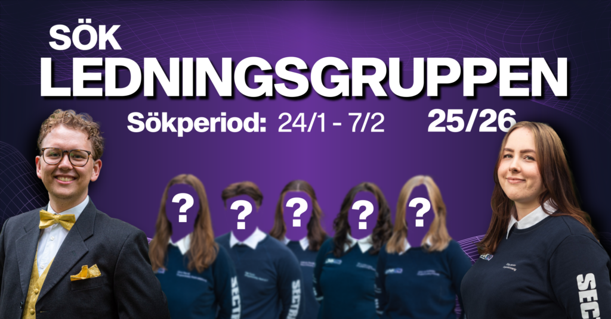

Hej D-sektionen! Vill du vara med och planera årets LINK-dagar? Känner du att du vill testa leda en grupp? Och känner du att du vill lära känna ett helt nytt gäng med folk från flera sektioner? Då har vi något för dig! Just nu rekryterar vi 5 personer som tillsammans med oss kommer utgöra LINK 2025:s ledningsgrupp! 

De poster som söks är gruppansvariga till LINKs fem undergrupper: Event, Företag, Marknadsföring, Mässa och Webb & IT! 

Vad innebär det att vara Gruppansvarig?

Som gruppansvarig kommer du under våren att få rekrytera din alldeles egna grupp, som du sedan kommer att få agera ledare för. Det blir ditt jobb att tillsammans med resterande i Ledningsgruppen se till så att alla vet hur de kan bidra till att göra LINK 2025 så bra som möjligt. Vi söker dig som är taggad och engagerad samt har någon form av intresse för data och IT. Låter detta intressant? Släng iväg din ansökan så fort som möjligt!  
  
Ansökningsperioden kommer att vara öppen fram till 7/2 och ansökan sker här:

[https://forms.gle/vNhnh8KEL5sdD4XFA](https://forms.gle/vNhnh8KEL5sdD4XFA)

Du kan även nominera en eller flera personer som du tror skulle passa till LINKs Ledningsgrupp, nomineringar sker på samma länk:

[https://forms.gle/vNhnh8KEL5sdD4XFA](https://forms.gle/vNhnh8KEL5sdD4XFA)   
  
Vill du veta mer om LINK? Kika in på [https://linkdagarna.se/information](https://linkdagarna.se/information) för mer information!Har du postspecifika frågor kan du kontakta sittande på posten, se postbeskrivningar i vårt event på Facebook: [https://fb.me/e/axWfvlFYs](https://fb.me/e/axWfvlFYs)

För andra frågor eller funderingar kan du kontakta projektledare för LINK 2025: Ebba Hansen på [ebba.hansen@linkdagarna.se](mailto:ebba.hansen@linkdagarna.se) eller Vice projektledare: Oskar Persson på [oskar.persson@linkdagarna.se](mailto:oskar.persson@linkdagarna.se) !
