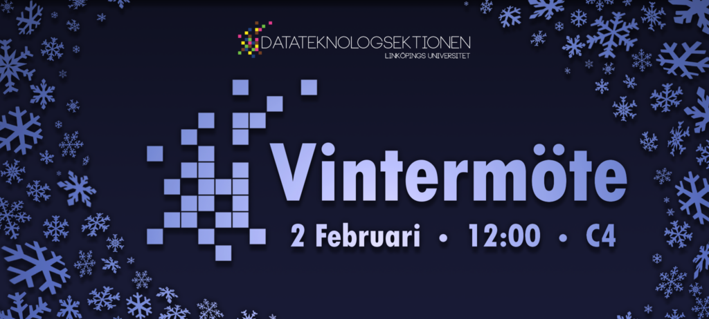

Vintermötet kommer att hållas **2:a februari** 2025 klockan **12:00** i sal **C4**.

Hej D-student! Här kommer information om sektionens vintermöte att samlas. Ett sektionsmöte är sektionens högst beslutande organ, och det är sektionsmöten som beslutar om till exempel sektionens budgetering, framtida arbetssätt, stadgar, reglemente, med mera. För mer information om hur ett sektionsmöte fungerar finns en beskrivning av relevanta termer och processer på [d-sektionen.se/sektionsmote](https://d-sektionen.se/sektionsmote/).

Observera att mycket information kommer läggas till under de kommande veckorna, så denna sida kommer att uppdateras kontinuerligt.

Styrelsen kommer bjuda på pizza i samband med sektionsmötet, länk för anmälan: [https://docs.google.com/forms/d/e/1FAIpQLSf-bgR10iJ7fNMRV4l5LkeMQ8UkgiA-GUKtohqSCM8JiueiWQ/viewform](https://docs.google.com/forms/d/e/1FAIpQLSf-bgR10iJ7fNMRV4l5LkeMQ8UkgiA-GUKtohqSCM8JiueiWQ/viewform)

Deadline för anmälan är 27 januari 2025.

## Att motkandidera

Glöm inte att du är mer än välkommen till att _motkandidera_ till någon av de poster som ska väljas in på mötet. Att motkandidera innebär att man, på mötet, kan nominera sig själv eller en annan till någon av posterna, utan att tidigare ha blivit nominerad av t.ex. valberedningen. Du kan även motkandidera genom att skicka ett mail till [sekreterare@d-sektionen.se](mailto:sekreterare@d-sektionen.se) där du skriver lite kort om dig själv samt vilken post du vill motkandidera till.

## Att skicka in motioner

Glöm dessutom inte att du är mer än välkommen att _skicka in motioner_. Detta görs enklast genom att skicka motionen via mail till [sekreterare@d-sektionen.se](mailto:sekreterare@d-sektionen.se). Motionsmall finns nedan under _Dokument_. Motioner måste skriftligen inkomma till sektionsstyrelsen senast sju läsdagar innan sektionsmötet (23 januari 2025).

## Protokoll

_Publiceras efter mötet_

## Föredragningslista

[Preliminär föredragningslista](https://d-sektionen.se/wp-content/uploads/2025/01/Preliminar_foredragningslista_vintermote_2025.pdf)

## Nomineringar

Valberedningen har valt att nominera följande: _Kommer inom kort_

- **Sektionsordförande**:

- **Sektionskassör**:

- **Vice ordförande**:

- **Sekreterare**:

- **Utbildningsutskottets ordförande**:

- **Arbetsmiljöombud**:

- **Eventutskottets ordförande**:

- **Styrelseledamöter**:

- **Jubileumsgeneral:**

- **Jubileumskassör:**

- **Damföreningens ordförande:**

- **Damföreningens kassör:**

- **Festeriets ordförande:**

- **Festeriets kassör:**

### Motkandideringar

_Inga inkomna_

### Presentation vid personval

Då du kandiderar till en post ska du under mötet presentera dig för mötet genom att berätta lite om dig själv och svara på eventuella frågor. För att ge en bild av vad presentationen innebär har styrelsen tagit fram några punkter över vad du skulle kunna berätta om:

- Vem du är

- Eventuella tidigare erfarenheter/engagemang utanför LiU

- Eventuella tidigare erfarenheter/engagemang på LiU

- Varför du söker en post

- Vad du skulle vilja göra med utskottet/posten

Dessa är endast förslag, och du är självklart fri att välja helt egna punkter att ta upp. De listade punkterna kommer finnas synliga på en duk under tiden du är uppe och presenterar.

## Dokument

[Kallelse Vintermöte 2025](https://d-sektionen.se/wp-content/uploads/2025/01/Kallelse_vintermote_2025.pdf)

[Måldokument 24/25](https://d-sektionen.se/wp-content/uploads/2024/12/Maldokument-24_25.pdf)

[Stadgar](https://styrdokument.d-sektionen.se/stadgar.pdf)

[Reglemente](https://d-sektionen.se/wp-content/uploads/2025/01/reglemente-2025_01_17.pdf)

Motionsmall [pdf](https://d-sektionen.se/wp-content/uploads/2019/10/Motionsmall-D-sektionen-2019.pdf), [odt](https://d-sektionen.se/wp-content/uploads/2019/10/Motionsmall-D-sektionen-2019.odt), [docx](https://d-sektionen.se/wp-content/uploads/2019/10/Motionsmall-D-sektionen-2019.docx)

[Policy för elektroniskt röstningssystem i samband med sektionsmöten](https://d-sektionen.se/wp-content/uploads/2019/10/elektroniskrostningpolicy.pdf)

## Inkomna dokument

_Inga inkomna än_

## Motioner och Propositioner

_Inga inkomna än_
