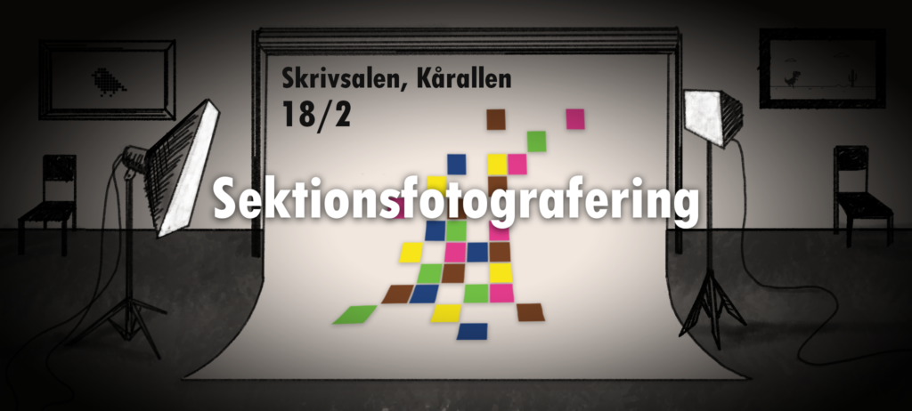

Kära sektion!

Snart är det äntligen dags för läsårets sektionsfotografering, som i år går av stapeln den **18:e februari**! I vanlig ordning kommer den att ske i **skrivsalen i Kårallen**.

Schemat för fotograferingen, som går att hitta nedan, är utformad så att inga krockar med utbildningsmoment ska ske om möjligt. Om tiden mot förmodan inte skulle passa så kan det gå att fixa en ny tid, men hör först med någon annan grupp ifall ni kan byta tid sinsemellan. Det är ytterst viktigt att ni kommer i god tid till ert foto, då schemat är väldigt tajt!

Som tidigare år erbjuder vi att alla klasser och utskott får ta ett “normalt” foto och ett så kallat spexfoto, där ni själva får komma något roligt tema för ert foto! Ni har fria tyglar här (givetvis får inget olämpligt dyka upp), så låt fantasin flöda fritt!

Om ni vill ha lite inspiration om vad man kan göra på ett spexfoto kan ni kolla på sektionens finfina fotoalbum och se hur andra har gjort tidigare år: [https://d-sektionen.se/filarkiv/fotoalbum/](https://d-sektionen.se/filarkiv/fotoalbum/)!

Har ni frågor över något om fotograferingen? Skicka i så fall iväg ett mail till [info@d-sektionen.se](mailto:info@d-sektionen.se)!

Allt gott,

//Infoutskottet 24/25

## Schema

_(Observera att att alla tider är satta till 15 minuter, samt att tiderna kan komma att ändras innan fotograferingen)_

08.00 Styret  
08.15 Kansliet  
08.30 U2  
08.45 MafU  
09.00 U1.a  
09.15 U1.b  
09.30 IP1.a  
09.45 IP1.b  
10.00 SchlagU  
10.15 U3  
10.30 D3  
10.45 Aristocats  
11.00 D-Group  
11.15 IT3  
11.30 Valberedningen  
11.45 AktU

12.00 D20  
12.15 IP3  
12.30 IP2  
12.45 IT2  
13.00 IT1  
13.15 D1.a  
13.30 D1.b  
13.45 D1.c  
14.00 Alumni  
14.15 D4+  
14.30 WebbU  
14.45 DEG  
15.00 IT4+  
15.15 UtbU  
15.30 U4+  
15.45 SexIT

16.00 NärU  
16.15 Donna  
16.30 Donnor (alla tjejer och icke-binära)  
16.45 D-LAN  
17.00 Werk  
17.15 D2  
17.30 PubU  
17.45 D-Band  
18.00 STABEN  
18.15 Custos  
18:30 Tackfestgruppen  
18.45 InfU
