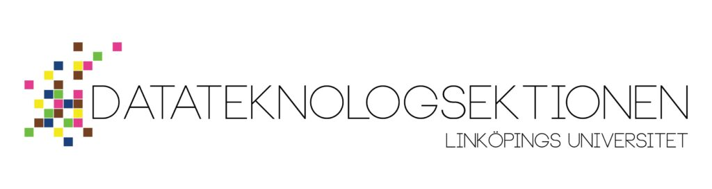

Kära D-studenter!

Nu är ansökningsperioden för de förtroendeposter som väljs in under vårmötet 2025 äntligen öppen!

Följande poster finns att söka:

- Alumniansvarig

- Infochef

- Intendent

- Marknadsföringsansvarig

- Näringslivsansvarig

- Pubutskottets ordförande

- Sakrevisor

- Studienämndsordförande D

- Studienämndsordförande U

- Studienämndsordförande IT

- Studienämndsordförande IP

- Studienämndsordförande Master

- Valberedningens ordförande

- Valberedningen ledamot x4

- Webmaster

Vill du veta lite mer om någon av posterna? Kika i så fall på postbeskrivningarna här: [https://d-sektionen.se/val/postbeskrivningar/](https://d-sektionen.se/val/postbeskrivningar/).

Vid eventuella frågor om någon specifik post är du välkommen att kontakta den nuvarande sittande. Samtliga sittandes kontaktinfo finns tillgänglig här: [https://d-sektionen.se/styrelsenkansli/](https://d-sektionen.se/styrelsenkansli/).

Om du känner dig intresserad av någon av posterna, eller om du vet att någon skulle passa perfekt till en post, så finns formuläret för att söka eller nominera här: [https://forms.gle/UGD7k2ucBKTGr9JW8](https://forms.gle/UGD7k2ucBKTGr9JW8).

Rekryteringen till valberedningen sköts av sektionens styrelse. Sökformulär & mer information om just detta kommer inom kort.

Om du har andra frågor är du välkommen att mejla oss på [val@d-sektionen.se](val@d-sektionen.se)!

Ansökningsperioden pågår från fram till **30/3 mars 23:59** och intervjuer med sökande kommer att hållas mellan **31/3-6/4**.

OBS: Sökperiodstiden ovan gäller enbart för den rekryteringen som sköts av valberedningen, d.v.s. alla poster förutom valberedningens ledamöter och ordförande.
