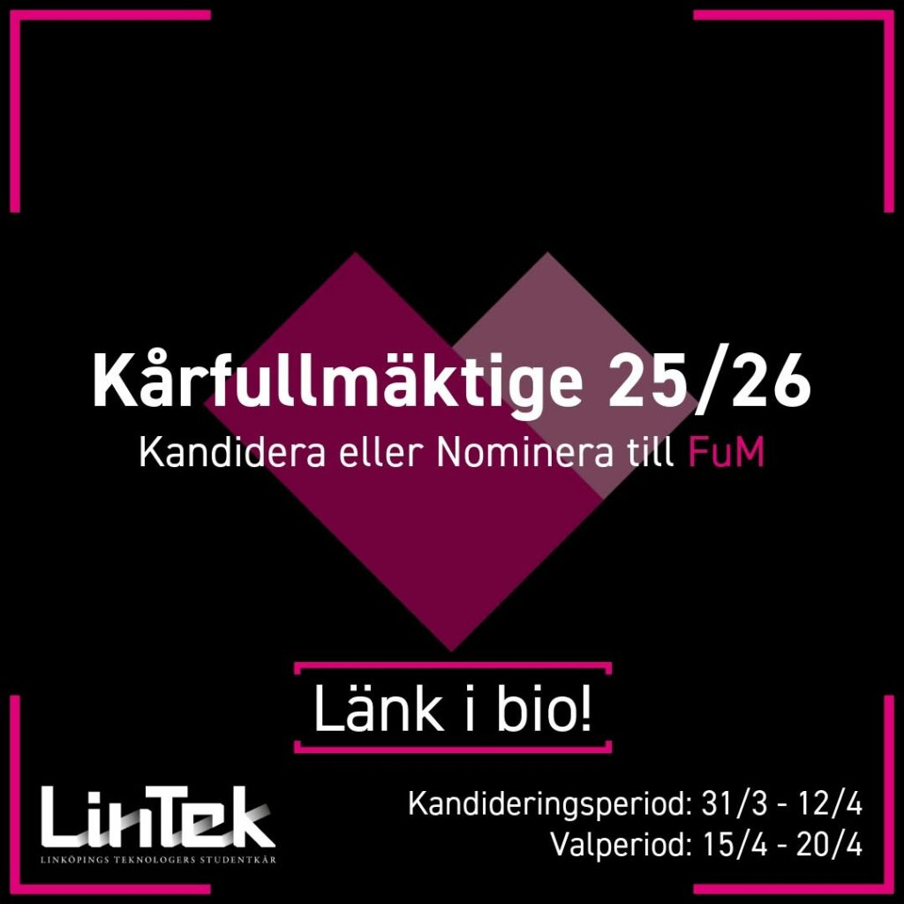

Hej sektionen!  
Här kommer ett meddelande från vår kära kår LinTek, som just har sin sökperiod igång för FuM! Gå in på [https://val.lintek.liu.se/](https://val.lintek.liu.se/) för att söka eller nominera, sökperioden tar slut 12/4. 

**\- - In English below - -**  
Vi i LinTeks valnämnd vill informera dig om att du kan kandidera till Kårfullmäktige (FuM) i LinTek.

Kårfullmäktige (FuM) består av 27 ledamöter som sitter på ett års mandat och man blir invald av LinTeks medlemmar. För att sitta i kårfullmäktige måste man vara medlem i LinTek, utöver det finns inget förkunskapskrav utan man lär sig det man behöver under året. Så länge man har åsikter man vill lyfta och läser möteshandlingarna kommer man långt.

**\- - English - -**  
We in the electoral committee would like to inform you, as a member of LinTek, can run for the Constituent Assembly (FuM) in LinTek.

The collective assembly (FuM) consists of 27 members who sit for a one-year mandate and are elected by LinTek's members. There is no prior knowledge requirement, but you learn what you need during the year. As long as you have opinions you want to raise and read the meeting documents, you will go a long way.
