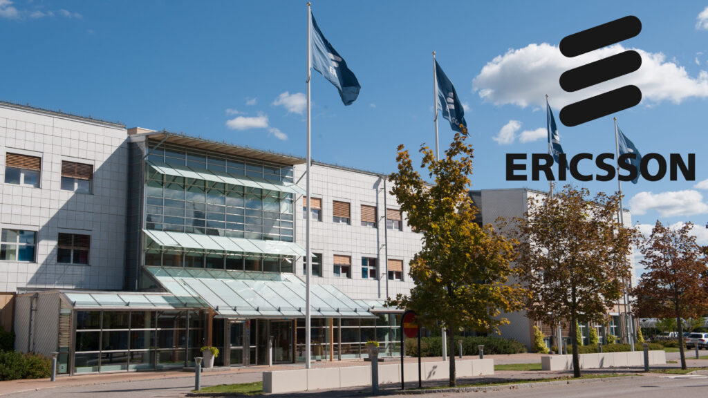

Vad händer efter examen och hur kan en karriär på Ericsson se ut?  
Kom och träffa några av oss som jobbar på Ericsson i Mjärdevi.  
Diskutera och ställ alla dina frågor som kan hjälpa dig att få en tydligare bild av tiden efter examen.  
Vi planerar en kväll med underhållning i form av en ”talk-show”.  
Sedan blir det mat och mingel (där ni får fråga nästan vad som helst) kombinerat med lite lek.  
Maten som serveras är en maffig fylld macka, följd av fika och snacks.  
När: Tisdag 20:e maj kl 17:30 – ca 20:30  
Var: Ericssons kontor i Mjärdevi, Datalinjen 4  
Anmäl dig [här](https://forms.gle/RvW4srkHBA1bceUM6) senast 16:e maj och glöm inte att meddela eventuella matallergier.

Läs mer om Ericsson: [https://www.ericsson.com/en/careers/student-young-professionals](https://www.ericsson.com/en/careers/student-young-professionals)  
Välkommen!

