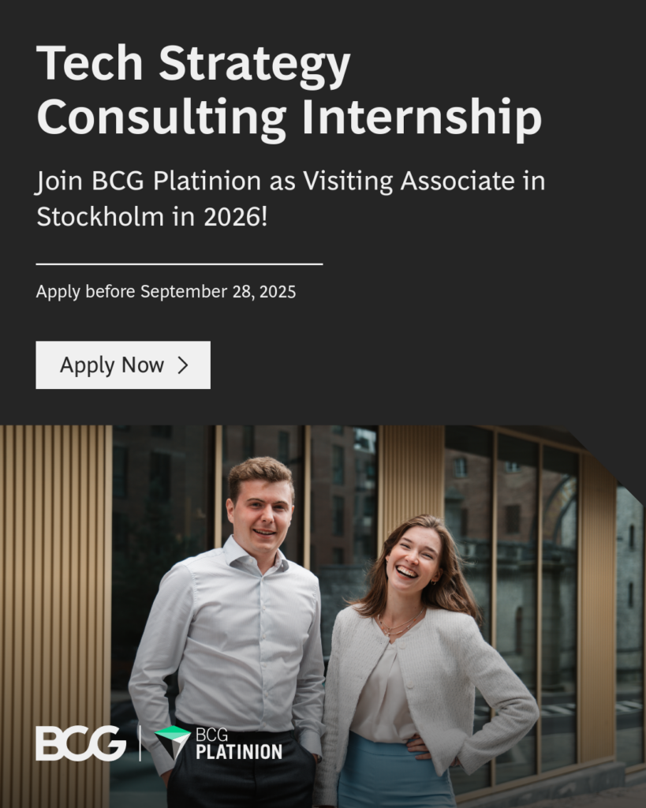

Are you a student passionate about technology and keen on a sneak peek into IT consulting? Applications are now open for 2026 Visiting  
 Associate internships at BCG Platinion, the tech advisory department of Boston Consulting Group (BCG)!

This is your opportunity to work at the intersection of tech and strategy, solve complex challenges for leading companies, and grow  
 alongside some of the brightest minds in the industry.

BCG Platinion offers international client cases and an unparalleled learning curve over 6 weeks, plus the chance to secure a full-time  
 offer at the end.

Apply by September 28 with your CV and all university transcripts by following this link:  
[on.bcg.com/bcgplatinion](http://on.bcg.com/bcgplatinion)
