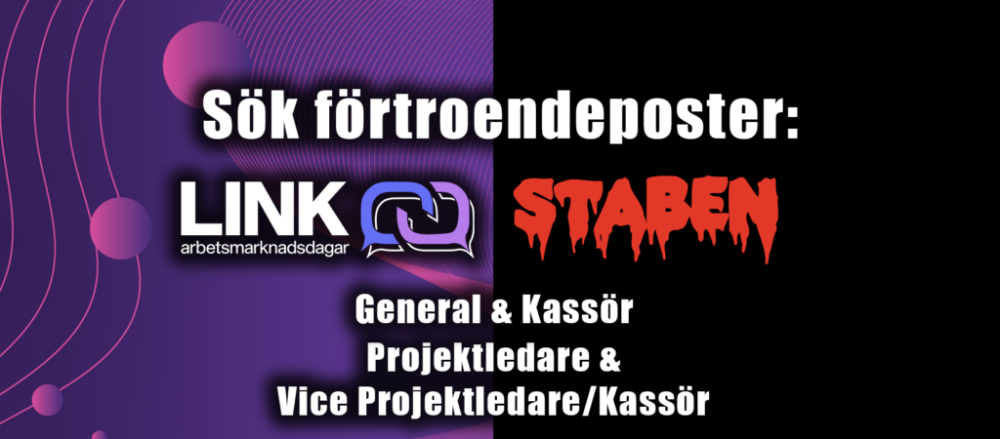

Tiden är kommen! Äntligen har ansökan till General och Kassör för STABEN 2026 samt Projektledare och Vice Projektledare/Kassör till LINK 26/27 öppnat. Vi i Valberedningen söker just nu en General och en Kassör till nästa års STABEN. En Projektledare och en Kassör till LINK söker vi tillsammans med Y-sektionens Valberedning.

Så är du taggad på att leda en grupp STABEN genom deras livs äventyr? Eller kanske se till att ekonomin går runt under tiden? Är du taggad på att ge Nollan ett oförglömligt Nolle-P? Sök till STABEN General eller STABEN kassör.

Vill du planera nästa års LINK och leda en stor grupp? Ha koll på alla företag som kommer på LINK och se till att ekonomin går ihop? – Då ska du ta chansen att söka LINK General eller LINK kassör.

—---------------------------------- Postbeskrivningar —----------------------------------

STABEN General

Som General är man ordförande för D-sektionens fadderi STABEN, och är ytterst ansvarig för D-sektionens mottagning. Postarbetet går ut på att med sin kassör välja in resterande STABEN, leda möten, koordinera utskottets arbete, samt vara en länk mellan STABEN, universitet och andra utomstående aktörer. Posten som General passar dig som är strukturerad och taggad på att leda och planera arbetet för en hel grupp.

STABEN Kassör

Som kassör i staben är man ytterst ansvarig för fadderiets ekonomiska situation. Man är även vice-ordförande och ansvarar tillsammans med Generalen för att välja in resten av STABEN, och hjälper därefter Generalen med dennes arbete. Du upprättar budget, följer upp kostnader och säkerställer att inkomster och utgifter hanteras korrekt. Posten som Kassör passar dig som är strukturerad och gillar att arbeta med siffror, ekonomi och planering.

LINK Projektledare  
Som projektledare har du tillsammans med Vice-projektledare/Kassör det övergripande ansvaret för att planera och genomföra LINK-dagarna. LINK-dagarna består av två veckors event, vilket mynnar ut i en mässa och en storslagen bankett. LINK-dagarna anordnas som ett samarbete mellan D-sektionen och Y-sektionen. I kommittén sitter ca 30 studenter från flera olika program, fakulteter och årskurser, vilket gör det till ett perfekt tillfälle att knyta kontakter.

Kommittén har tidigare bestått av sex grupper -ledningsgruppen, IT-gruppen, marknadsföringsgruppen, mässgruppen, företagsgruppen och eventgruppen. Ditt jobb är att, tillsammans med vice/kassören, rekrytera kommittén och sedan leda den i arbetet fram till mässan. I rollen ingår allt från rekrytering och projektledning till näringslivskontakt, och det finns goda möjligheter att knyta kontakter inför framtiden. Som projektledare får man stor inblick i alla delar av projektet. Inom LINK finns det stora chanser för förbättringar och möjlighet att få testa sina idéer. Då LINK tillhör både Y- och D-sektionen kommer du att sitta med i båda sektionernas kanslier.  
  

  
LINK Vice Projektledare/Kassör  
Som Vice Projektledare/Kassör för LINK-dagarna ansvarar du tillsammans med projektledaren för genomförandet av LINK-dagarna. Du är också ytterst ekonomiskt ansvarig, vilket innebär ansvar över bland annat budgetering. Bokföringen gör D-sektionens ekonomiutskott DEG åt dig. 

Posten innebär mycket eget ansvar för de ekonomiska delarna, samt också mycket utrymme för egna idéer om hur man bäst bistår projektledaren i rollen som vice projektledare. 

—---------------------------------- Ansökan —----------------------------------

Känner du att någon av posterna lockar dig, eller vet du kanske någon som passar perfekt? Gå in på formulären nedan för att ansöka/nominera:

[Ansökan och nominering LINK](https://docs.google.com/forms/d/1q3qu7cgkWRVZqeyqc4tMWLzL6DNjF-fkkD8nKF773Ho/edit)

[Ansökan och nominering STABEN](https://docs.google.com/forms/d/1YpbwjVwk5AGubYtqAMxpsO-F8RkLkrmBFTkv1yx3EHI/edit)

—------------------------------- Kontakt vid frågor och Funderingar—-------------------------------

Har du några frågor eller funderingar, så var inte rädd för att maila D-sektionens valberedningen på [jorunn.johannesdottir@d-sektionen.se](mailto:jorunn.johannesdottir@d-sektionen.se) (för frågor om ansökan till om STABEN eller LINK) eller Y-sektionens valberedning på [kontakt.valberedning@ysektionen.se](mailto:kontakt.valberedning@ysektionen.se) (för frågor om ansökan till om LINK) . 

Det går alltid att skriva till de nuvarande sittande på posterna för mer postspecifika frågor:

STABEN General, Jorunn Jóhannesdóttir: [general@staben.info](mailto:generalen@staben.info)

STABEN Kassör, William Minidis: [kassor@staben.info](mailto:kassor@staben.info)

LINK Projektledare, Ebba Hansen: [projektledare@linkdagarna.se](mailto:projektledare@linkdagarna.se) 

LINK Vice Projektledare/Kassör, Oskar Persson: [kassor@linkdagarna.se](mailto:kassor@linkdagarna.se)

Ansökan för STABEN och LINK är öppen fram till kl 23:59 den 12:e oktober och intervjuerna kommer att ske löpande, så passa på och sök eller nominera! 

—---------------------------------- Valberedningens urvalsprocess —----------------------------------

Mer information om valberedningens urvalsprocess finns på: [https://d-sektionen.se/wp-content/uploads/2021/03/Valberedningens-Urvalsprocess.pdf](https://d-sektionen.se/wp-content/uploads/2021/03/Valberedningens-Urvalsprocess.pdf) 

(Obs, informationen nedan gäller endast ansökan till STABEN)

D-sektionens valberedningen har även i år valt att ha som intern policy att om en person söker flera poster så är det inte garanterat att personen får sitt förstahandsval om det är konkurrens om posten. 

Ett exempel: Person A och B söker STABEN General, och de båda uppfyller valberedningens kravprofil för STABEN General. Person B söker även STABEN Kassör och är den mest lämpade kandidaten för denna post. Då kan det bli så att valberedningen nominerar person A till General och person B till Kassör.
