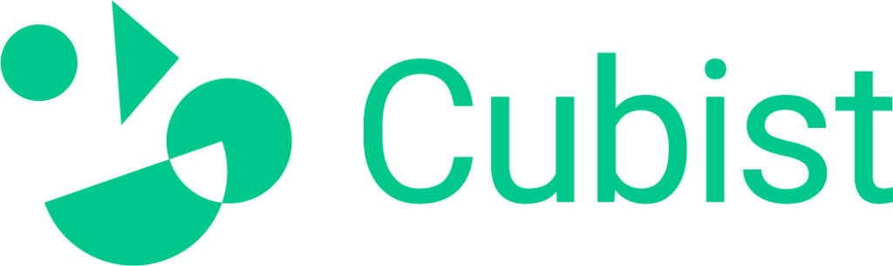

**Hej D-sektionen!**  
Är du snart klar eller kanske till och med nyutexaminerad från ett program på D-sektionen? Är du intresserad av att jobba med ett spännande projekt inom medicinsk teknik där du verkligen kan göra skillnad?

Vi söker en civilingenjör som vill jobba som konsult inom mjukvaruutveckling i Stockholm på heltid. Ditt första projekt är redan planerat med start runt mars 2026.

**Projektbeskrivning:**  
CIPN (Chemotherapy induced Peripheral Neuropathy) är en allvarlig biverkning vid  
behandling av patienter med bröstcancer. Det påverkar flertalet autonoma funktioner i  
kroppen och drabbar mellan 30-40% av alla patienter som genomgår cellgiftsbehandling.

I ett projekt med flera partners kommer vi nu utveckla en helt ny metod för att upptäcka, monitorera och hantera CIPN.

Lösningen är en kombination av ett instrument för mätning av nervsignaler tillsammans  
med en AI-baserad mjukvara för att bedöma enskilda patienters risk att utveckla CIPN.

Vi söker en ny medarbetare som vill vara med och utveckla följande:

• En molnbaserad AI-modell som är skräddarsydd för ändamålet  
• En applikation som kan visualisera instrumentmätningarna  
• Integration mellan applikation och instrument

**Vilka är vi?**  
Vi är ett teknikkonsultbolag med verksamhet inom flera olika brancher men med starkt  
fokus på medicinsk teknik och datadrivna lösningar inom hälsosektorn. Idag består teamet av ett 20-tal konsulter och vi har kontor nära T-centralen i Stockholm.

**Låter detta intressant?** Mejla CV och betyg till rekryterande chef:  
[atahan.tolunay@cubist.eu](mailto:atahan.tolunay@cubist.eu)

Hemsida: [https://www.cubist.eu/](https://www.cubist.eu/)  
LinkedIn: [https://www.linkedin.com/company/cubist-it-health/](https://www.linkedin.com/company/cubist-it-health/)

