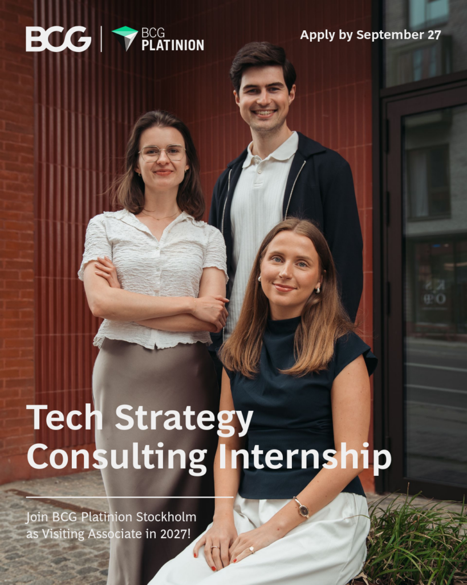

Six weeks. Real client challenges. A front-row seat to tech strategy consulting.

Applications are now open for 2027 Visiting Associate internships at BCG Platinion, the tech strategy advisory unit of Boston Consulting Group (BCG).

Tailored for students passionate about technology and curious about management consulting, the six-week internship gives you the opportunity to work with leading companies, learn from experienced consultants, and explore the intersection of technology, business, and strategy.

You can expect international client cases, a steep learning curve, and the possibility to secure a full-time offer at the end of the internship.

Learn more and apply by September 27 with your CV, including a short motivational paragraph on the role, and all university transcripts: https://www.bcgplatinion.com/careers/internships/it-strategy-consulting-internship-2027-nordics

