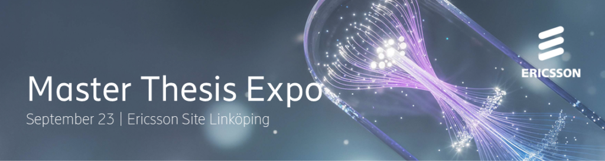

Writing your master’s thesis in spring 2027? Ericsson’s  
thesis opportunities span across 5G and 6G, artificial intelligence, machine learning,  
cloud computing, security, signal processing, software engineering and platform  
engineering.​  
Register your interest today!  
[https://ericsson.eightfold.ai/events/candidate/landing?plannedEventId=ZQ1qZyL5wn](https://ericsson.eightfold.ai/events/candidate/landing?plannedEventId=ZQ1qZyL5wn)

Hope to see you there!​  
Team Ericsson ​

